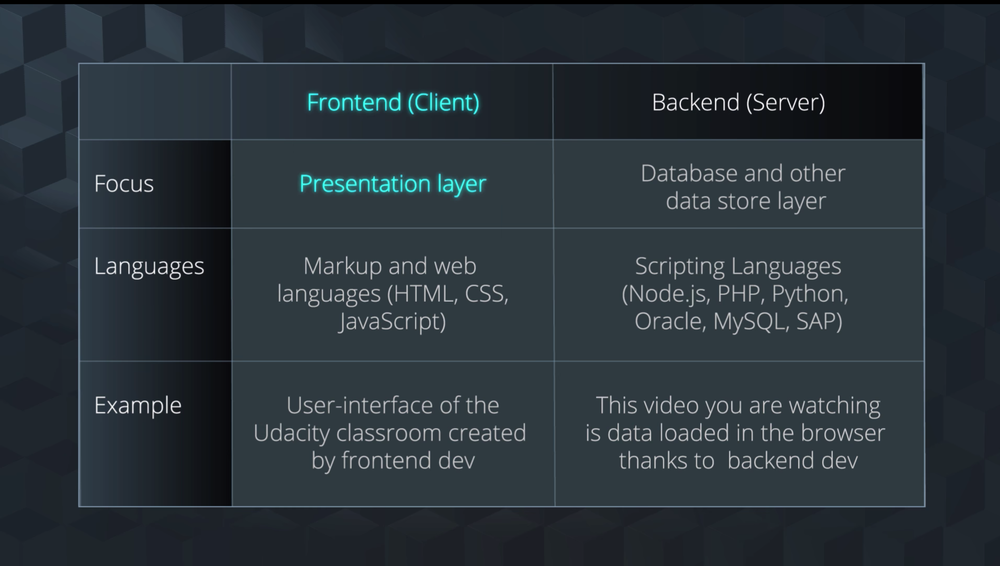
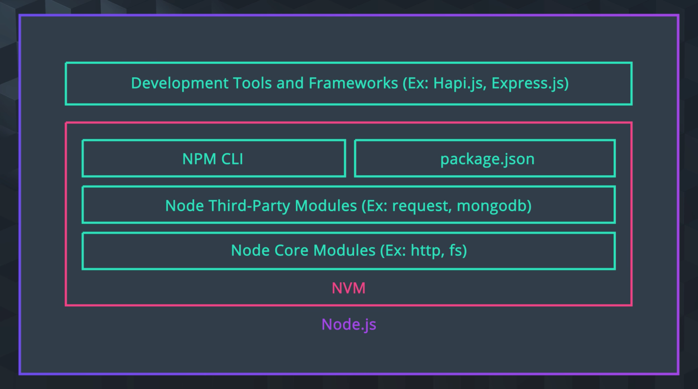

# 1. Interview: What's a Web Service?
# 2. Lesson Overview

## Resources

This course assumes you already have some familiarity with the concept of web services and are comfortable using Javascript. If not, please take some time to review the resources we’ve linked below. Having a grasp of these topics will make your experience learning the upcoming topics much easier.

- [Designing RESTful APIs | Udacity](https://www.udacity.com/course/designing-restful-apis--ud388)
- [HTTP & Web Servers | Udacity](https://www.udacity.com/course/http-web-servers--ud303)
- [Intro to JavaScript | Udacity](https://www.udacity.com/course/intro-to-javascript--ud803)

# 3. What is a Web Service?

## Topics

- **What is a web service?**
- Web services with Blockchain considerations
- Planning web services with our private blockchain

Web Service: A Web service is a function that can be accessed by other programs over the web.

Web services vs. Websites
- Websites allow people to communicate and collaborate with each other.
- Web services allow programs to communicate and collaborate with each other.




# 4. Web Service with Blockchain con...

- What is a web service?
- **Web services with Blockchain considerations**
- Planning web services with our private blockchain

## Do You Really Need A Blockchain?

### Problem of Value Identification

- Is there a need to share information, credentials or value with others?
- Is trust a critical requirement to the process?
- Do you need to prove to others you are transacting/reporting accurately?
- Is there potential to monetize the data or digital asset in the value chain?
- Who owns the problem? Individual or industry wide challenges?

### Stakeholders buy in

- Is there a network of stakeholders (i.e. more than 2)?
- Is there a dependency on others for information?
- Does more than one participant need to update the data?
- Is there scope to open up the ecosystem to ancillary parties in the future?
- Are you working with other industry players on any activities?

### Technical considerations

- Is there any ongoing need or future requirements for high data throughput?
- Do you rely or use public data sources to make decisions?
- Do you need to store a particularly rich/complex data structure?
- Do you need to digitize assets in your value chain?
- Do you need transaction privacy? Do you need anonymity?

# 5. Planning Web Services with Our Private Blockchain

- What is a web service?
- Web services with Blockchain considerations
- **Planning web services with our private blockchain**

## Resources

Need a review for Web Services or Javascript? Checkout these courses:

- Designing Restful APIs Course
- Web Servers Course
- Intro to Javascript

## Upcoming plan to build web service with private blockchain

- Configure API web service with GET/POST endpoints
    - Build and deploy local web service with Node.js
    - Configure API endpoints with static mock data for testing
        - GET - Block by ID
        - POST - New Block
- Migrate your private blockchain to your API web service
    - Configure API endpoints to interact with your private blockchain
        - GET - Block by ID
        - POST - New Block
    - Create a method to validate blockchain health

# 6. Web Services with Node.js
# 7. Node.js Intro

Reasons for JavaScript
- Popular Developer Language
- Lots of Existing Tooling
- Simple, Expressive, Powerful

Deciding On a Web Service Language
- Are you concerned with frontend, backend or both?
- How well is the language maintained?
- How well does this language intergrate with other systems?
- What's its performance like?

Reasons for Node.js
- Very memery efficient
- Scalable
- Large ecosystem of open-source libraries
- Cleaner codebase(same language both frontend and backend)

# 8. Node.js Setup

## Node.js Setup

### Step 1

Run this command to see if you already have node on your computer and if so, what version. 

- `node --version`

### Step 2

If either it shows you do not have node installed yet, or do not have the latest stable version, navigate to [nodejs.org](https://nodejs.org/en/) and install the latest version.

### Step 3

Re-run the node --version command to verify the correct version of Node.js has installed. 

# 9. Node.js Components



Modules
Related code that is encapsulated into modules. They can be thought of as JavaScript Libraries.

Core Modules
The bare minimum Node.js functionalities provided to you.

Third Party Modules
A wrapper for some API functions of third party companies.

package.json
A file that lives in the root of your package/application. Tells npm how your package is structured and how to install it.
Similar to a manifest in other applications.

Node Package Manager(npm)
A package manager for Node.js package or modules.

Node Version Manager(nvm)
A tool that allows you to seamlessly switch between different versions of Node.
You can install each version with a single command and set a default via the command line interface.


# 10. Node.js Client and Server Features

## Node.js Client and Server Features

We are going to talk at a high-level about the client and server endpoints we can expect when building out a blockchain integrated web service.

### Purpose of this topic

The purpose of this topic is to showcase that Node.js Client and Server features for blockchain web service integration is not too different from web service with other data storage methods (e.g. file storage, database) you've worked with before.

We will show you code in raw Node.js (no frameworks) to help you get a clear sense of the mechanics.

For our project, you'll be given the a front-end (client) portion; however, here's how a simplified client-server request and responding to a blockchain web service:

- Client: Web front-end
    - Consume and interact with backend services
    - Endpoints
        - Get - Block by ID
        - Post - New block
- Server: Backend RESTful service
    - Server client side requests
    - Endpoints
        - Get - Block by ID
        - Post - New block

Now, before we see an example of a web service involving blockchain, it's helpful to review how we would handle a typical Node HTTP request.

### Node Server-Side HTTP Reading from a File (no blockchain data yet)

First, let’s take a look at a simple code snippet involving a web server not related to blockchain. It’s a Node.js web service using file and http libraries that obtains data from a request which can be used to construct output for a response.

```js
// Code snippet from https://www.w3schools.com/nodejs/nodejs_http.asp
// Http library
const http = require('http');
// File service library
const fs = require('fs');
// Http port
const port = 3000;
// Filename for file service to load
const filename = "index.html";
// Configure web service
const app = http.createServer(function (request, response){
  response.writeHead(200, {"Content-Type": "text/html"});
  response.end(fs.readFileSync(__dirname + "/" + filename));
});
// Notify console
console.log("Web Server started on port 3000\nhttp://localhost:"+port);
// Start server with http port
app.listen(port);
```

### Code Explanation

- Instantiate an HTTP server with a request handler function, and have it listen on a port.
- Get headers, URL, method and body data from request objects.
- Make routing decisions based on URL and/or other data in request objects.
- Send headers, HTTP status codes and body data via response objects.
- Pipe data from request objects and to response objects.
- Handle stream errors in both the request and response streams.

While it is simple, the point I want to make is that the hurdles with using just raw Node.js (i.e. not utilizing and frameworks or third-party libraries) just to handle HTTP means configuring your project to support methods already set for RESTful solutions.

Even in this simple example, there's definitely room for improvement that RESTful frameworks such as Express.js, Sails.js, and Hapi.js can provide. These frameworks are tools that help build high-speed, real-time, end-to-end applications, without using third party web server.

This will set the stage for the next lesson where we dive deeper into understanding RESTful frameworks we can plug into Node.js.

### Ndde Server Side Using Blockchain Mock Data

Now, instead of reading from a file as we did above, let’s redo the call using mock data with block variables to respond to a GET request.

```js
// Http library
const http = require('http');
// Http port
const port = 8080;
// Configure web service
const app = http.createServer(function (request, response){
response.writeHead(200, {"Content-Type": "application/json"});
let block = {"height":"0","body":"123"};
response.write(JSON.stringify(block));
response.end();
});
// Notify console
console.log("Web Server started on port 3000\nhttp://localhost:"+port);
// Start server with http port
app.listen(port);
```

Notice that many of the HTTP requests are similar to what you're familiar with already with minor changes to where we are writing the data.

Again, while this was a very simplified use case, there’s a lot of room for improvement.

### Conclusion

This sets the stage for what will be covered later in this course - using web application frameworks such as Hapi.js and Express.js that will provide a convenient API to build HTTP servers in Node as well as third-party libraries for other blockchain platform interactions.

You will get a chance to interact with all this in much more depth as we move forward. For now, keep in mind the principle that integrating the blockchain with web services is similar to web service interactions you've done before.

# 11. Practice Client-Server Features

## Let's do some Code Practice

- Step 1	Clone the project repository in this [Github](https://github.com/udacity/nd1309_exercise_client_server) repository
- Step 2	Open the terminal and install the packages: `npm install`
- Step 3	Open the file app.js and start coding - See additional info below
- Step 4	Run your application `node app.js`
- Step 5	Go to your browser and type: `http://localhost:8080/`
- Step 6	Get the hash generated in your browser and answer the quiz in your classroom

### Additional info for Step 3
#### Review the boilerplate code

```js
// Http library
const http = require('http');

//Step 1. Import crypto-js/sha256


// Http port
const port = 8080;

//Mock Data
var blocks = [];
let block_1 = {"height":"0","body":"Udacity Blockchain Developer", "time": 1538509789};
let block_2 = {"height":"1","body":"Udacity Blockchain Developer Rock!", "time": 1538509789};
blocks.push(block_1);
blocks.push(block_2);

//Step 2. Configure web service
/**
 * Take the block_2 data from the array "blocks" and generate the hash to be written into the response.
 */
//Add your code here


// Notify console
console.log("Web Server started on port 8080\nhttp://localhost:"+port);
// Start server with http port
app.listen(port);
```

As you can see the tasks you have to complete are:

1. Import crypto-js/sha256
2. Create the variable `app` assigning the function: const 

`app = http.createServer(function (request, response){ // your code go here}`

The problem that you have to solve is add to the response of this service the hash generated from the data of block_2 object that is in the array blocks.

After that get the hash generated in your browser and come back and answer the quiz.

Q. Select the correct Hash
> 905c01245ee5bb571d41248b9e3ca5f9a280acb07134678712741015abf785ca

# 12. Mock Data Set

Mock Data Set
- Why use mock data?
    - Block Size
    - Chain Size
    - Performance
    - Security
    - Data Corruption
- Choosing an initial data set
    Knowing the desired outputs ahead of time allow you to focus on particular endpoint solutions. This type of planning typically requires mock data.

# 13. Testing endpoints

## Testing Endpoints

Testing endpoints in one of the most important tasks that we need to do when we are developing a RESTful API. To do that we are going to introduce 2 powerful tools to help with this - Postman and Curl.

There are other tools available, so feel free to use those if you're already familiar with them.

### Postman

POSTMAN is an application that allow you to test your endpoints with Graphical User Interface application.

To install Postman, go to [Postman](https://www.getpostman.com/), and download & install the appropriate package for your OS.

Once you have it installed locally in your computer let's do this test:

Open Postman and paste: https://maps.googleapis.com/maps/api/directions/json?origin=Florence&destination=Milan&waypoints=Genoa|Bologna|Venice&optimizeWaypoints=true&key=[YOUR_API_KEY]

Then, check the parameters in the param button and hit SEND option. The application make the request and should show you the response from the server api like it is showed in the video below.

This was simple example but POSTMAN allows you to do some more complex requests, you can tests GET, POST, PUT, DEL and other more types of requests.

To get more help on this you can read the documentation [page](https://www.getpostman.com/docs/v6/)

### Let's solve this Quiz

Let's try this exercise, use the following api url: `https://jsonplaceholder.typicode.com/todos/5` and select the correct "title" property value

> laboriosam mollitia et enim quasi adipisci quia provident illum

### CURL

CURL is used in command lines or scripts to transfer data, so it can be used to test our RESTful APIs.

Let's check a quick example:

```shell
curl -X GET \
  https://jsonplaceholder.typicode.com/todos/1 \
  -H 'Cache-Control: no-cache' \
  -H 'Content-Type: application/x-www-form-urlencoded' \
```

### Curl Resources

[free Curl book](https://curl.haxx.se/book.html)

# 14. Lesson Summary

This lesson was all about planning and developing the mental framework for how to go about converting a private a blockchain into a valuable web service.

In this lesson, we discussed how to:

- Analyze blockchain use case to determine if it requires a web service
- Decide on a web service language
- Explain Node.js framework and components for blockchain
- Decide an appropriate mock data set

Coming up, we will begin the process to configure web API service with GET/POST endpoints.