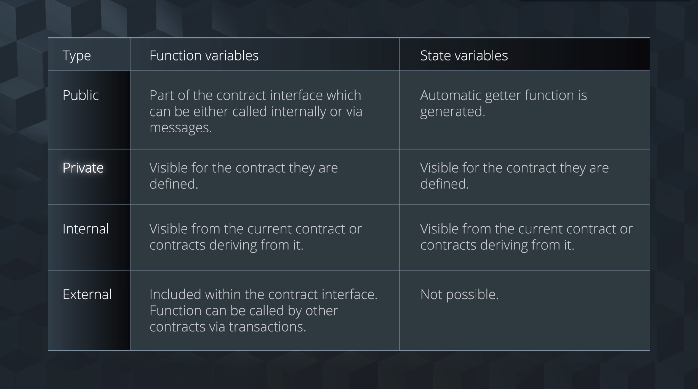

# 1.Lesson Introduction

### By the End of This Lesson...

You will ...

- Use MetaMask to interact with smart contract from the webpage
- Write Javascript tests for smart contracts
- Explore the purpose of Ethereum Improvement Protocols
- Use OpenZepplin to increase smart contract security
- Use Infura to easily deploy smart contracts on the Rinkeby Ethereum test network

# 2. Getting Started with MetaMask

## Getting Started with MetaMask

### Resources

- [MetaMask website](https://metamask.io/)
- [Remix](http://remix.ethereum.org/)
- [http-server](https://www.npmjs.com/package/http-server)

## Code

Summary of code changes made to the `index.html` file:

- Allow Metamask to inject its own web3.js object
- Modify function claimButtonClicked() to replace the logic of setting a default account by asking the web3 object what accounts are available and take the top one

```html
<!DOCTYPE html>
<html lang="en">
    <head>
        <meta charset="UTF-8">
        <meta name="viewport" content="width=device-width, initial-scale=1.0">
        <title>Star Notary</title>
        <link rel="stylesheet" type="text/css" href="style.css">

        <script src="https://cdn.jsdelivr.net/gh/ethereum/web3.js/dist/web3.min.js"></script>
    </head>

    <body>
        <div class="container">
            <h1>Star Notary</h1>

            <div class="row">
                <label class="bold">Star Name:</label>
                <label id="star-name"></label>
            </div>

            <div class="row">
                <label class="bold">Star Owner:</label>
                <label id="star-owner"></label>
            </div>

            <button id="claim-button" onclick="claimButtonClicked()">Claim Star</button>
        </div>

        <script>    

            if(typeof web3 != 'undefined') { 
                web3 = new Web3(web3.currentProvider) // what Metamask injected 
            } else {
                // Instantiate and set Ganache as your provider
                web3 = new Web3(new Web3.providers.HttpProvider("http://localhost:8545"));
            }
            // The default (top) wallet account from a list of test accounts 
            web3.eth.defaultAccount = web3.eth.accounts[0];
            // The interface definition for your smart contract (the ABI) 
            var StarNotary = web3.eth.contract(
                [
                    {
                        "constant": false,
                        "inputs": [],
                        "name": "claimStar",
                        "outputs": [],
                        "payable": false,
                        "stateMutability": "nonpayable",
                        "type": "function"
                    },
                    {
                        "anonymous": false,
                        "inputs": [
                            {
                                "indexed": false,
                                "name": "owner",
                                "type": "address"
                            }
                        ],
                        "name": "starClaimed",
                        "type": "event"
                    },
                    {
                        "inputs": [],
                        "payable": false,
                        "stateMutability": "nonpayable",
                        "type": "constructor"
                    },
                    {
                        "constant": true,
                        "inputs": [],
                        "name": "starName",
                        "outputs": [
                            {
                                "name": "",
                                "type": "string"
                            }
                        ],
                        "payable": false,
                        "stateMutability": "view",
                        "type": "function"
                    },
                    {
                        "constant": true,
                        "inputs": [],
                        "name": "starOwner",
                        "outputs": [
                            {
                                "name": "",
                                "type": "address"
                            }
                        ],
                        "payable": false,
                        "stateMutability": "view",
                        "type": "function"
                    }
                ]
            );
            // Grab the contract at specified deployed address with the interface defined by the ABI
            var starNotary = StarNotary.at('0x8040086095e9bc41535094bf03eae1f6178b5260');

            // Get and display star name
            starNotary.starName(function (error, result) {
                if (!error) {
                    document.getElementById('star-name').innerText = result
                } else { 
                    console.log(error);
                }
            });
            // Get and display star owner
            starNotary.starOwner(function (error, result) {
                if (!error) {
                    document.getElementById('star-owner').innerText = result
                } else { 
                    console.log(error);
                }
            });
            // Enable claim button being clicked
            function claimButtonClicked() { 
                web3.eth.getAccounts(function(error, accounts) { 
                    if (error) { 
                        console.log(error)
                        return
                    }
                    var account = accounts[0]
                    starNotary.claimStar(function (error, result) {
                        if (!error) {
                            var starClaimedEvent = starNotary.starClaimed({from: account});
                            starClaimedEvent.watch(function(error, result) {
                                if (!error) {
                                    location.reload();
                                } else {
                                    console.log('watching for star claimed event is failing');
                                }
                            });
                        } else { 
                            console.log(error);
                        }
                    });

                })
            }
        </script>
    </body>
</html>
```

# 3. Unit tests in Javascript and Sollidity with Truffle

## Unit tests in Javascript and Solidity with Truffle

When developing software, testing is vital to ensure quality. In this concept, we will go over how to write basic unit tests using the Truffle test suite and write out some unit tests in our start notarization service as an example.

## Resources

- [Truffle Framework](https://truffleframework.com/)
- [Visual Studio Code](https://code.visualstudio.com/)
- [Solidity support for Visual Studio code](https://marketplace.visualstudio.com/items?itemName=JuanBlanco.solidity)

## Deploy the Contract

As shown in the video above, you can compile, migrate, and deploy this contract using the truffle framework. 

```
truffle init
truffle starNotaryTest.js
```

## Code

In the `StarNotaryTest.js` file

```js
const starDefinition = artifacts.require('StarNotary')

contract('StarNotary', accounts => { 
    var owner = accounts[0]
    var contractInstance 

    beforeEach(async function () { 
        contractInstance = await starDefinition.new({from: owner})
    })

    describe('StaryNotary basics', () => { 
        it('has correct name', async function () { 
            assert.equal(await contractInstance.starName(), 'Awesome Udacity Star')
        })

        it('can be claimed', async function () { 
            assert.equal(await contractInstance.starOwner(), 0)
            await contractInstance.claimStar({from: owner})
            assert.equal(await contractInstance.starOwner(), owner)
        })
    })

    describe('Star can change owners', () => { 
        beforeEach(async function () { 
            assert.equal(await contractInstance.starOwner(), 0)
            await contractInstance.claimStar({from: owner})
        })

        it('can be claimed by a second user', async function () {
            var secondUser = accounts[1]
            await contractInstance.claimStar({from: secondUser})

            assert.equal(await contractInstance.starOwner(), secondUser)
        })
    })
})
```

# 4. Ethereum Inprovement Proposals and Standards

## Ethereum Inprovement Proposals and Standards
### Resources

- [Ethereum Improvement Proposals](https://github.com/ethereum/EIPshttps://eips.ethereum.org/)
- [ERC-721](https://github.com/ethereum/EIPs/blob/master/EIPS/eip-721.md)

## Definitions

- Ethereum Improvement Proposals (EIPs) - The standards followed to proposal updates to the Ethereum platform, including core protocol specifications, client APIs, and contract standards.
- Ethereum Request for Comments (ERC) - Application-level standards and conventions, including contract standards such as token standards. One of the most famous is ERC20 which set a standard interface for tokens.
- Fungible asset - a good that can be replaced by another identical item; mutually interchangeable. Example - Money is fungible. If wanted to spend a dollar, it doesn’t matter if I spend this dollar bill, or that dollar bill, as the value of all dollar bills is the same.
    - ERC20 - Tokens created with the ERC20 interface are fungible.
- Non-fungible asset - A good distinguishable assets that is unique. Example - Goods such as land, artwork, or collectibles are unique. One collectable baseball card cannot be replace by another.
- ERC721 - Tokens created with the ERC721 interface are non-fungible. Recall earlier we saw that [CryptoKitties use the ERC721](https://medium.com/loom-network/how-to-code-your-own-cryptokitties-style-game-on-ethereum-7c8ac86a4eb3) token spec because each CryptoKitty is considered a unique collectible.

# 5. Star Notary as ERC-721

## Star Notary as ERC - 721

In this section, we will discuss how to implement the ERC-721 interface. Once we implement the functions required for the interface, we will implement unit tests in Javascript and Solidity with the help of Truffle.

We'll do this in 4 steps throughout this concept.

- Step 1: ERC-721 Basics
- Step 2: Build out the Functions
- Step 3: Transfer Logic
- Step 4: Set Approval Method

### Step1: ERC-721 Basics

[ERC-721 Interface Definition](https://github.com/ethereum/EIPs/blob/master/EIPS/eip-721.md)

### Step2: Build out the Function

Now that you've gotten up and running with ERC-721, you'll need to implement some logic to the token functions. In the next video, we'll do exactly that!

### Step 3: Transfer Logic

The next step in building out our ERC-721 token is to build out the transfer logic.

### Step 4: Set Approval Method

Finally, we'll add in functionality that gives permissions for an operator to transfer all your tokens. 


### Resources

My Ether Wallet
ERC-721 Interface Definition

## Code

- ERC721.sol - This is a standard description, and a copy of the interface definition.
- ERC721Token.sol - This contract is our implementation of the ERC721 interface.
- ERC721TokenTest.js - This file contains the tests for the ERC721Token.sol contract.

### ERC721.sol

```js
pragma solidity ^0.4.20;

/// @title ERC-721 Non-Fungible Token Standard
/// @dev See https://github.com/ethereum/EIPs/blob/master/EIPS/eip-721.md
interface ERC721 {
    /// @dev This emits when ownership of any NFT changes by any mechanism.
    ///  This event emits when NFTs are created (`from` == 0) and destroyed
    ///  (`to` == 0). Exception: during contract creation, any number of NFTs
    ///  may be created and assigned without emitting Transfer. At the time of
    ///  any transfer, the approved address for that NFT (if any) is reset to none.
    event Transfer(address indexed _from, address indexed _to, uint256 indexed _tokenId);

    /// @dev This emits when the approved address for an NFT is changed or
    ///  reaffirmed. The zero address indicates there is no approved address.
    ///  When a Transfer event emits, this also indicates that the approved
    ///  address for that NFT (if any) is reset to none.
    event Approval(address indexed _owner, address indexed _approved, uint256 indexed _tokenId);

    /// @dev This emits when an operator is enabled or disabled for an owner.
    ///  The operator can manage all NFTs of the owner.
    event ApprovalForAll(address indexed _owner, address indexed _operator, bool _approved);

    /// @notice Count all NFTs assigned to an owner
    /// @dev NFTs assigned to the zero address are considered invalid, and this
    ///  function throws for queries about the zero address.
    /// @param _owner An address for whom to query the balance
    /// @return The number of NFTs owned by `_owner`, possibly zero
    function balanceOf(address _owner) external view returns (uint256);

    /// @notice Find the owner of an NFT
    /// @dev NFTs assigned to zero address are considered invalid, and queries
    ///  about them do throw.
    /// @param _tokenId The identifier for an NFT
    /// @return The address of the owner of the NFT
    function ownerOf(uint256 _tokenId) external view returns (address);

    /// @notice Transfers the ownership of an NFT from one address to another address
    /// @dev Throws unless `msg.sender` is the current owner, an authorized
    ///  operator, or the approved address for this NFT. Throws if `_from` is
    ///  not the current owner. Throws if `_to` is the zero address. Throws if
    ///  `_tokenId` is not a valid NFT. When transfer is complete, this function
    ///  checks if `_to` is a smart contract (code size > 0). If so, it calls
    ///  `onERC721Received` on `_to` and throws if the return value is not
    ///  `bytes4(keccak256("onERC721Received(address,address,uint256,bytes)"))`.
    /// @param _from The current owner of the NFT
    /// @param _to The new owner
    /// @param _tokenId The NFT to transfer
    /// @param data Additional data with no specified format, sent in call to `_to`
    function safeTransferFrom(address _from, address _to, uint256 _tokenId, bytes data) external payable;

    /// @notice Transfers the ownership of an NFT from one address to another address
    /// @dev This works identically to the other function with an extra data parameter,
    ///  except this function just sets data to "".
    /// @param _from The current owner of the NFT
    /// @param _to The new owner
    /// @param _tokenId The NFT to transfer
    function safeTransferFrom(address _from, address _to, uint256 _tokenId) external payable;

    /// @notice Transfer ownership of an NFT -- THE CALLER IS RESPONSIBLE
    ///  TO CONFIRM THAT `_to` IS CAPABLE OF RECEIVING NFTS OR ELSE
    ///  THEY MAY BE PERMANENTLY LOST
    /// @dev Throws unless `msg.sender` is the current owner, an authorized
    ///  operator, or the approved address for this NFT. Throws if `_from` is
    ///  not the current owner. Throws if `_to` is the zero address. Throws if
    ///  `_tokenId` is not a valid NFT.
    /// @param _from The current owner of the NFT
    /// @param _to The new owner
    /// @param _tokenId The NFT to transfer
    function transferFrom(address _from, address _to, uint256 _tokenId) external payable;

    /// @notice Change or reaffirm the approved address for an NFT
    /// @dev The zero address indicates there is no approved address.
    ///  Throws unless `msg.sender` is the current NFT owner, or an authorized
    ///  operator of the current owner.
    /// @param _approved The new approved NFT controller
    /// @param _tokenId The NFT to approve
    function approve(address _approved, uint256 _tokenId) external payable;

    /// @notice Enable or disable approval for a third party ("operator") to manage
    ///  all of `msg.sender`'s assets
    /// @dev Emits the ApprovalForAll event. The contract MUST allow
    ///  multiple operators per owner.
    /// @param _operator Address to add to the set of authorized operators
    /// @param _approved True if the operator is approved, false to revoke approval
    function setApprovalForAll(address _operator, bool _approved) external;

    /// @notice Get the approved address for a single NFT
    /// @dev Throws if `_tokenId` is not a valid NFT.
    /// @param _tokenId The NFT to find the approved address for
    /// @return The approved address for this NFT, or the zero address if there is none
    function getApproved(uint256 _tokenId) external view returns (address);

    /// @notice Query if an address is an authorized operator for another address
    /// @param _owner The address that owns the NFTs
    /// @param _operator The address that acts on behalf of the owner
    /// @return True if `_operator` is an approved operator for `_owner`, false otherwise
    function isApprovedForAll(address _owner, address _operator) external view returns (bool);
}
```

### ERC721Token.sol

```js
pragma solidity ^0.4.24; 

import './ERC721.sol';

contract ERC721Token is ERC721 {

    mapping(uint256 => address) tokenToOwner; 
    mapping(address => uint256) ownerToBalance; 
    mapping(uint256 => address) tokenToApproved;
    mapping(address => mapping(address => bool)) ownerToOperator;

    modifier hasPermission(address _caller, uint256 _tokenId) { 
        require(_caller == tokenToOwner[_tokenId] 
        || getApproved(_tokenId) == _caller 
        || isApprovedForAll(tokenToOwner[_tokenId], _caller));
        _;
    }

    function mint(uint256 _tokenId) public { 
        require(tokenToOwner[_tokenId] == address(0), "this token belongs to someone else already");

        tokenToOwner[_tokenId] = msg.sender; 
        ownerToBalance[msg.sender] += 1;

        emit Transfer(address(0), msg.sender, _tokenId);
    }

    /// @notice Count all NFTs assigned to an owner
    /// @dev NFTs assigned to the zero address are considered invalid, and this
    ///  function throws for queries about the zero address.
    /// @param _owner An address for whom to query the balance
    /// @return The number of NFTs owned by `_owner`, possibly zero
    function balanceOf(address _owner) external view returns (uint256) { 
        require(_owner != address(0), "cannot ask of balance of address 0");
        return ownerToBalance[_owner];
    }

    /// @notice Find the owner of an NFT
    /// @dev NFTs assigned to zero address are considered invalid, and queries
    ///  about them do throw.
    /// @param _tokenId The identifier for an NFT
    /// @return The address of the owner of the NFT
    function ownerOf(uint256 _tokenId) external view returns (address) { 
        return tokenToOwner[_tokenId];
    }

    /// @notice Transfers the ownership of an NFT from one address to another address
    /// @dev Throws unless `msg.sender` is the current owner, an authorized
    ///  operator, or the approved address for this NFT. Throws if `_from` is
    ///  not the current owner. Throws if `_to` is the zero address. Throws if
    ///  `_tokenId` is not a valid NFT. When transfer is complete, this function
    ///  checks if `_to` is a smart contract (code size > 0). If so, it calls
    ///  `onERC721Received` on `_to` and throws if the return value is not
    ///  `bytes4(keccak256("onERC721Received(address,address,uint256,bytes)"))`.
    /// @param _from The current owner of the NFT
    /// @param _to The new owner
    /// @param _tokenId The NFT to transfer
    /// @param data Additional data with no specified format, sent in call to `_to`
    function safeTransferFrom(address _from, address _to, uint256 _tokenId, bytes data) external payable { 
        // WILL NOT IMPLEMENT
    }

    /// @notice Transfers the ownership of an NFT from one address to another address
    /// @dev This works identically to the other function with an extra data parameter,
    ///  except this function just sets data to "".
    /// @param _from The current owner of the NFT
    /// @param _to The new owner
    /// @param _tokenId The NFT to transfer
    function safeTransferFrom(address _from, address _to, uint256 _tokenId) external payable { 
        // WILL NOT IMPLEMENT
    }

    /// @notice Transfer ownership of an NFT -- THE CALLER IS RESPONSIBLE
    ///  TO CONFIRM THAT `_to` IS CAPABLE OF RECEIVING NFTS OR ELSE
    ///  THEY MAY BE PERMANENTLY LOST
    /// @dev Throws unless `msg.sender` is the current owner, an authorized
    ///  operator, or the approved address for this NFT. Throws if `_from` is
    ///  not the current owner. Throws if `_to` is the zero address. Throws if
    ///  `_tokenId` is not a valid NFT.
    /// @param _from The current owner of the NFT
    /// @param _to The new owner
    /// @param _tokenId The NFT to transfer
    function transferFrom(address _from, address _to, uint256 _tokenId) external payable hasPermission(msg.sender, _tokenId) { 

        tokenToOwner[_tokenId] = _to; 
        ownerToBalance[_from] -= 1;

        emit Transfer(_from, _to, _tokenId);
    }

    /// @notice Change or reaffirm the approved address for an NFT
    /// @dev The zero address indicates there is no approved address.
    ///  Throws unless `msg.sender` is the current NFT owner, or an authorized
    ///  operator of the current owner.
    /// @param _approved The new approved NFT controller
    /// @param _tokenId The NFT to approve
    function approve(address _approved, uint256 _tokenId) external payable { 
        require(tokenToOwner[_tokenId] == msg.sender);

        tokenToApproved[_tokenId] = _approved;

        emit Approval(msg.sender, _approved, _tokenId);
    }

    /// @notice Enable or disable approval for a third party ("operator") to manage
    ///  all of `msg.sender`'s assets
    /// @dev Emits the ApprovalForAll event. The contract MUST allow
    ///  multiple operators per owner.
    /// @param _operator Address to add to the set of authorized operators
    /// @param _approved True if the operator is approved, false to revoke approval
    function setApprovalForAll(address _operator, bool _approved) external { 
        ownerToOperator[msg.sender][_operator] = _approved;

        emit ApprovalForAll(msg.sender, _operator, _approved);
    }

    /// @notice Get the approved address for a single NFT
    /// @dev Throws if `_tokenId` is not a valid NFT.
    /// @param _tokenId The NFT to find the approved address for
    /// @return The approved address for this NFT, or the zero address if there is none
    function getApproved(uint256 _tokenId) public view returns (address) { 
        return tokenToApproved[_tokenId];
    }

    /// @notice Query if an address is an authorized operator for another address
    /// @param _owner The address that owns the NFTs
    /// @param _operator The address that acts on behalf of the owner
    /// @return True if `_operator` is an approved operator for `_owner`, false otherwise
    function isApprovedForAll(address _owner, address _operator) public view returns (bool) { 
        return ownerToOperator[_owner][_operator];
    }
}
```

### ERC721TokenTest.js

```js
const ERC721Token = artifacts.require('ERC721Token')

contract('ERC721Token', accounts => { 
    var defaultAccount = accounts[0]
    var user1 = accounts[1]
    var user2 = accounts[2]
    var operator = accounts[3]

    beforeEach(async function() { 
        this.contract = await ERC721Token.new({from: defaultAccount})
    })

    describe('can create a token', () => { 
        let tokenId = 1
        let tx

        beforeEach(async function () { 
            tx = await this.contract.mint(tokenId, {from: user1})
        })

        it('ownerOf tokenId is user1', async function () { 
            assert.equal(await this.contract.ownerOf(tokenId), user1)
        })

        it('balanceOf user1 is incremented by 1', async function () { 
            let balance = await this.contract.balanceOf(user1)

            assert.equal(balance.toNumber(), 1)
        })

        it('emits the correct event during creation of a new token', async function () { 
            assert.equal(tx.logs[0].event, 'Transfer')
        })
    })

    describe('can transfer token', () => { 
        let tokenId = 1
        let tx 

        beforeEach(async function () { 
            await this.contract.mint(tokenId, {from: user1})

            tx = await this.contract.transferFrom(user1, user2, tokenId, {from: user1})
        })

        it('token has new owner', async function () { 
            assert.equal(await this.contract.ownerOf(tokenId), user2)
        })

        it('emits the correct event', async function () { 
            assert.equal(tx.logs[0].event, 'Transfer')
            assert.equal(tx.logs[0].args._tokenId, tokenId)
            assert.equal(tx.logs[0].args._to, user2)
            assert.equal(tx.logs[0].args._from, user1)
        })

        it('only permissioned users can transfer tokens', async function() { 
            let randomPersonTryingToStealTokens = accounts[4]

            await expectThrow(this.contract.transferFrom(user1, randomPersonTryingToStealTokens, tokenId, {from: randomPersonTryingToStealTokens}))
        })
    })

    describe('can grant approval to transfer', () => { 
        let tokenId = 1
        let tx 

        beforeEach(async function () { 
            await this.contract.mint(tokenId, {from: user1})
            tx = await this.contract.approve(user2, tokenId, {from: user1})
        })

        it('set user2 as an approved address', async function () { 
            assert.equal(await this.contract.getApproved(tokenId), user2)
        })

        it('user2 can now transfer', async function () { 
            await this.contract.transferFrom(user1, user2, tokenId, {from: user2})

            assert.equal(await this.contract.ownerOf(tokenId), user2)
        })

        it('emits the correct event', async function () { 
            assert.equal(tx.logs[0].event, 'Approval')
        })
    })

    describe('can set an operator', () => { 
        let tokenId = 1
        let tx 

        beforeEach(async function () { 
            await this.contract.mint(tokenId, {from: user1})

            tx = await this.contract.setApprovalForAll(operator, true, {from: user1})
        })

        it('can set an operator', async function () { 
            assert.equal(await this.contract.isApprovedForAll(user1, operator), true)
        })
    })
})

var expectThrow = async function(promise) { 
    try { 
        await promise
    } catch (error) { 
        assert.exists(error)
        return
    }

    assert.fail('Expected an error but didnt see one!')
}
```

# 6. Transform Star Notary into a Non-Fungible Token

## Transform Star Notary into a Non-Fungible Token Part 2



### Resources

[Visibility and Getters](https://solidity.readthedocs.io/en/v0.4.24/contracts.html#visibility-and-getters)

## Code

- StarNotary.sol - Transforms star notary service into non-fungible token by implementing the ERC721 interface setup in the previous concept
- StarNotaryTest.js which tests:
    - Buying and selling stars
    - User can sell a star
    - User can buy a star that was put up for sale

### StarNotary.sol

```js
pragma solidity ^0.4.23;

import './ERC721Token.sol';

contract StarNotary is ERC721Token { 

    struct Star { 
        string name; 
    }

    mapping(uint256 => Star) public tokenIdToStarInfo; 
    mapping(uint256 => uint256) public starsForSale;

    function createStar(string _name, uint256 _tokenId) public { 
        Star memory newStar = Star(_name);

        tokenIdToStarInfo[_tokenId] = newStar;

        ERC721Token.mint(_tokenId);
    }

    function putStarUpForSale(uint256 _tokenId, uint256 _price) public { 
        require(this.ownerOf(_tokenId) == msg.sender);

        starsForSale[_tokenId] = _price;
    }

    function buyStar(uint256 _tokenId) public payable { 
        require(starsForSale[_tokenId] > 0);

        uint256 starCost = starsForSale[_tokenId];
        address starOwner = this.ownerOf(_tokenId);
        require(msg.value >= starCost);

        clearOtherStates(_tokenId);

        ERC721Token.transferFromHelper(starOwner, msg.sender, _tokenId);

        starOwner.transfer(starCost);

        if(msg.value > starCost) { 
            msg.sender.transfer(msg.value - starCost);
        }
    }


    function clearOtherStates(uint256 _tokenId) private { 
        // clear approvals
        tokenToApproved[_tokenId] = address(0);

        // clear being on sale 
        starsForSale[_tokenId] = 0;
    }
}
```

### StarNotaryTest.js

```js
const StarNotary = artifacts.require('StarNotary')

contract('StarNotary', accounts => { 

    beforeEach(async function() { 
        this.contract = await StarNotary.new({from: accounts[0]})
    })

    describe('can create a star', () => { 
        it('can create a star and get its name', async function () { 
            let tokenId = 1

            await this.contract.createStar('Awesome Star!', tokenId, {from: accounts[0]})

            assert.equal(await this.contract.tokenIdToStarInfo(tokenId), 'Awesome Star!')
        })
    })

    describe('buying and selling stars', () => { 

        let user1 = accounts[1]
        let user2 = accounts[2]

        let starId = 1
        let starPrice = web3.toWei(.01, "ether")

        beforeEach(async function () {
            await this.contract.createStar('awesome star', starId, {from: user1})
        })

        describe('user1 can sell a star', () => { 
            it('user1 can put up their star for sale', async function () { 
                await this.contract.putStarUpForSale(starId, starPrice, {from: user1})

                assert.equal(await this.contract.starsForSale(starId), starPrice)
            })

            it('user1 gets the funds after selling a star', async function () { 
                let starPrice = web3.toWei(.05, 'ether')

                await this.contract.putStarUpForSale(starId, starPrice, {from: user1})

                let balanceOfUser1BeforeTransaction = web3.eth.getBalance(user1)
                await this.contract.buyStar(starId, {from: user2, value: starPrice})
                let balanceOfUser1AfterTransaction = web3.eth.getBalance(user1)

                assert.equal(balanceOfUser1BeforeTransaction.add(starPrice).toNumber(), 
                            balanceOfUser1AfterTransaction.toNumber())
            })
        })

        describe('user2 can buy a star that was put up for sale', () => { 
            beforeEach(async function () { 
                await this.contract.putStarUpForSale(starId, starPrice, {from: user1})
            })

            it('user2 is the owner of the star after they buy it', async function () { 
                await this.contract.buyStar(starId, {from: user2, value: starPrice})

                assert.equal(await this.contract.ownerOf(starId), user2)
            })

            it('user2 correctly has their balance changed', async function () { 
                let overpaidAmount = web3.toWei(.05, 'ether')

                const balanceOfUser2BeforeTransaction = web3.eth.getBalance(user2)
                await this.contract.buyStar(starId, {from: user2, value: overpaidAmount, gasPrice:0})
                const balanceAfterUser2BuysStar = web3.eth.getBalance(user2)

                assert.equal(balanceOfUser2BeforeTransaction.sub(balanceAfterUser2BuysStar), starPrice)
            })
        })
    })
})
```


# 7. Getting Started with OpenZeppelin

## Getting Started with OpenZeppelin

OpenZeppelin is a wonderful resource to find open-sourced libraries and standards to make smart contract development super fast. We'll update our StarNotary.sol contract using code from OpenZeppelin.

`npm install --save-exact openzeppelin-solidity@2.0.0-rc.1`

### Resources

- [Open Zeppelin](https://openzeppelin.org/)
- [Open Zeppelin Github](https://github.com/OpenZeppelin/openzeppelin-solidity)
- [NPM Installation](https://docs.npmjs.com/cli/install)

## Code

We updated the `StartNotary.sol` contract with code from OpenZepplin.

```js
pragma solidity ^0.4.23;

import 'openzeppelin-solidity/contracts/token/ERC721/ERC721.sol';

contract StarNotary is ERC721 { 

    struct Star { 
        string name; 
    }

    mapping(uint256 => Star) public tokenIdToStarInfo; 
    mapping(uint256 => uint256) public starsForSale;

    function createStar(string _name, uint256 _tokenId) public { 
        Star memory newStar = Star(_name);

        tokenIdToStarInfo[_tokenId] = newStar;

        _mint(msg.sender, _tokenId);
    }

    function putStarUpForSale(uint256 _tokenId, uint256 _price) public { 
        require(this.ownerOf(_tokenId) == msg.sender);

        starsForSale[_tokenId] = _price;
    }

    function buyStar(uint256 _tokenId) public payable { 
        require(starsForSale[_tokenId] > 0);

        uint256 starCost = starsForSale[_tokenId];
        address starOwner = this.ownerOf(_tokenId);
        require(msg.value >= starCost);

        _removeTokenFrom(starOwner, _tokenId);
        _addTokenTo(msg.sender, _tokenId);

        starOwner.transfer(starCost);

        if(msg.value > starCost) { 
            msg.sender.transfer(msg.value - starCost);
        }
    }
}
```

# 8. Infura

## Infura

Let's see how to take advantage of Infura to deploy our smart contract without needing to download a full node saving us time and memory space. Using Infura eliminates the need to install, configure, and maintain costly Ethereum infrastructure.

## Resources

- [Infura](https://infura.io/)
- [Etherscan](https://etherscan.io/)

## Code

In order to use Infura to deploy our smart contract, we updated the truffle.js file by adding in the url path through infrura’s systems as the provider:

- Check mnemonic at ganache-cli
- truffle deploy --network rinkeby

```js
var HDWalletProvider = require('truffle-hdwallet-provider');

var mnemonic = 'PASTE MNEMONIC HERE';

module.exports = {
  networks: { 
    development: {
      host: '127.0.0.1',
      port: 8545,
      network_id: "*"
    }, 
    rinkeby: {
      provider: function() { 
        return new HDWalletProvider(mnemonic, 'PASTE URL HERE') //from Infura
      },
      network_id: 4,
      gas: 4500000,
      gasPrice: 10000000000,
    }
  }
};
```

# 9. Lesson Recap