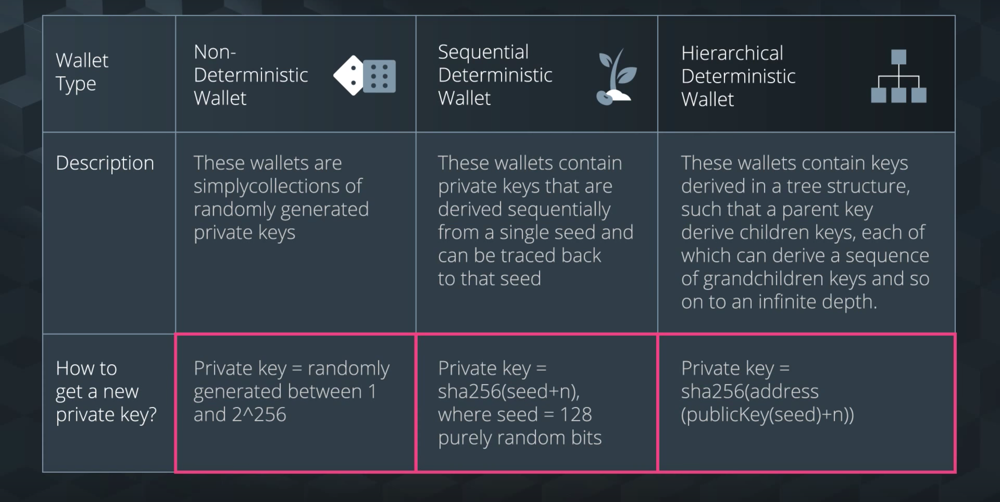
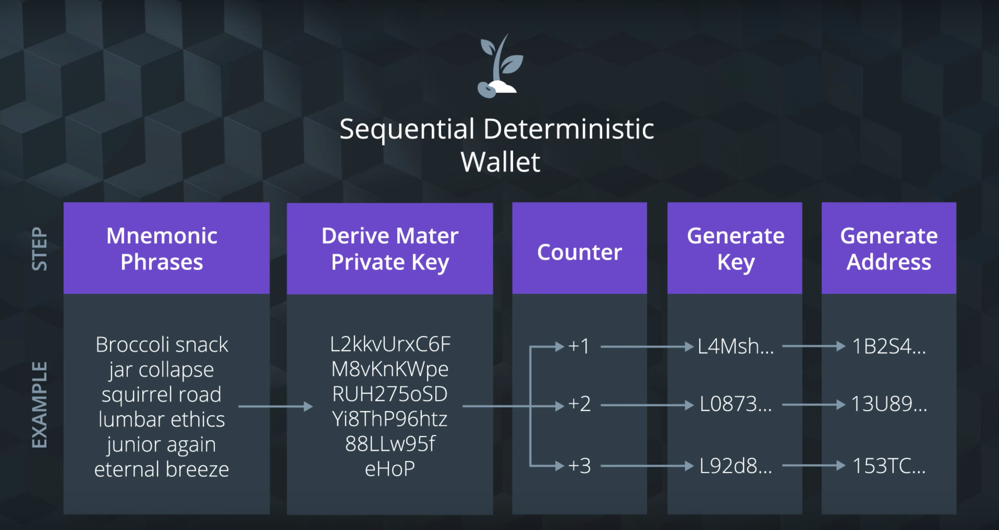
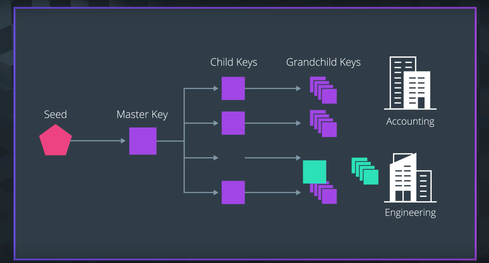
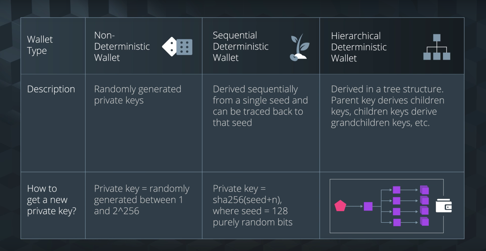

# 1. Lesson Introduction

Blockchains are a transaction-based system, so the topic of Transactions is important!

In this lesson, you’ll pull together the individual concepts we introduced earlier - keys, blocks, wallets, etc - and understand how they interact together to form a secure transaction.

By the end of this lesson you will:

- Understand the mechanics of a simple transaction between 2 entities (e.g. Joe and Jessica) using private keys, public keys, wallets, and public blockchain.
- Determine and generate the appropriate wallet type for the needs of a given situation. (Non-deterministic, Sequential Deterministic, and Hierarchical Deterministic)
- Create and restore a bitcoin wallet using private keys.
- Recognize signing transactions as a part of the transaction lifecycle and can describe its purpose and process.

Let’s get transacting!

# 2. Interview: Blockchain Identity
# 3. Blockchain Identity

## Blockchain Identity

Welcome to this section on blockchain identity! Like a social security number, a bank account, a drivers license, or a club membership, your blockchain identity is how you establish yourself in the world, in this case the blockchain world.

In this section, we'll go over the basics of blockchain identities. You'll hear many new terms and ideas that will help set you up to create and manage your own personal blockchain identity.

## Blockchain Identity Overview

we'll cover things like wallet addresses, private keys, public keys, and more to learn what they are and how they contribute to creating your blockchain identity.

## Blockchain Hashing Algorithms
## Key terms

- Wallet Address: A unique identifier for your wallet
- Private Key: A secret number that allows you to spend bitcoin from your wallet.
- Public Key: Publicly shareable key that cannot be used to spend bitcoin.

## Problem: Identity Terms

Q) Fill in the blanks for the diagram above to cement the relationship between Private Keys, Public Keys, Bitcoin Wallets, Public Key Hashes, and Bitcoin Wallet Addresses, and the algorithms to interact between them.

Elliptical Curve Multiplication Algorithm
Public Key
RIPEMD160(SHA256())
Public Key Hash
Base58Check
Bitcoin Wallet Address

## Wrapping Up

# 4. Wallet Overview

## Wallet Types

In this section, we'll go over the basics of wallets, and cover different wallet types to help you determine which is right for you.

## Wallet Types Overview

## Key Terms

- Non-deterministic Wallet: (random wallets) A wallet where private keys are generated from random numbers.
- Deterministic Wallet: A wallet where addresses, private keys, and public keys can be traced back to their original seed words.
- Hierarchical Deterministic Wallet: An advanced type of deterministic wallet that contains keys derived in a tree structure.(Infinite depth)

## Wrapping Up

# 5. Wallet Types

## Wallet Types
## Non-Deterministic Wallets

Random number -> Private Key -> Public Key -> Wallet Address

## Deterministic Wallets

There are two types of deterministic wallets
- Sequential Deterministic Wallet
- Hierarchical Deterministic (HD) Wallet (BIP32)

## Wallet Scenarios

### Scenario 1

I want to create paper wallets derived from one master key so I can store and recover all of them deterministically. Which wallet is used to achieve this?

- [] Non-Deterministic Wallet
- [x] Sequential Deterministic Wallet
- [] Hierarchical Deterministic Wallet

### Scenario 2

I’m creating a web server that sells widgets and want to generate an unique transaction address for every customer and every address and track it independently. I want to be able to take a master public key and generate a sequence of sub-public keys, each associated with a transaction and put it on a public web server and **make sure the web server has no private keys.**

- [] Non-Deterministic Wallet
- [] Sequential Deterministic Wallet
- [x] Hierarchical Deterministic Wallet

### Scenario 3

Scenario 3: A shoe supply chain is being audited. The auditors are given a public key so they can see all the transactions of the sub tree but they can’t unlock it. Which wallet is used to achieve this?

- [] Non-Deterministic Wallet
- [] Sequential Deterministic Wallet
- [x] Hierarchical Deterministic Wallet

### Scenario 4

A blockchain social media website uses private keys to secure personal user data. It uses wallets for backend services that use private keys that are not derived from a seed. Which wallet is used to achieve this?

- [] Non-Deterministic Wallet
- [] Sequential Deterministic Wallet
- [x] Hierarchical Deterministic Wallet

## Wrap Up

# 6. Private keys

## Private Keys
## Private Keys Overview

what private keys actually are and why they're important.

256bits in hexadecimal is 32bytes.

## Key Terms

- Private Key: (is just) A 256-bit random number between 1 and 2^256.
- Entropy: Lack of order or predictability. The degree of disorder or randomness in the system.

## How to Generate a Private key

- What's the purpose of a private key?
    - Private Keys generate Public Keys and Wallet Address that allow us to interact with the blockchain
- What makes a private key secure?
    - A private Key is a 256-bit random number between 1 and 2^256
- How to generate a private key?
    - Paper, pencil, coin, dice
    - OS with source of entropy or library with cryptographic secure number generator
    - Bitcoin address generating websites
    - Software wallets

## Generate Your Own Private Key

Choose at least one of the methods below to generate a Private key. Check off the one(s) you tried.

- [] Old School - Grab a paper, pencil, and pair of dice. [Detailed instructions here](https://bitcointalk.org/index.php?topic=297077.msg3197393#msg3197393).
- [] Offline wallet generator - Follow [these instructions](https://github.com/bigmob/cryptosteel-tutorial/wiki/How-to-generate-private-key-offline-with-Bitaddress) to use a wallet generator such as BitAddress offline.
- [] Software wallet Such as [Electrum](https://electrum.org/). Find a full list of [Bitcoin wallets here](https://bitcoin.org/en/choose-your-wallet)

## Wrap Up

# 7. Get Your Own Wallet

## Bitcoin Wallet Overview
## Choose a Wallet
### Electrum
### Getting Started with Electrum

# 8. Restoring Blockchain Identity

## Restore your Wallet Identity

This could happen for a few reasons

- You might forget your password.
- You could lose the 2-step verification device.
- The wallet service might even become unavailable.
- It’s also possible that you lose your computer or it gets stolen.

## Ways to Restore a Wallet

there are 2 ways to do it.

### Use a Seed

One way to restore a wallet is using a seed. The ‘seed’ is the 12 words you were given when creating your wallet. If you can remember these words, you can use them to restore your wallet!

The benefit of restoring your identity using the seed is that it can be much simpler than using the private key. It's easier to remember a list of words than a random string of numbers and letters.

The hardest part to any of this is safely storing or remembering this information for when you need it. Anybody else who discovers the list of words can access the wallet and any funds tied to it.

So be VERY careful!

### Use a Private Key

Another way to restore a wallet is with a private key.

When restoring a wallet using a private key, there are 2 ways to do it. You can either import or sweep this key, and it’s useful to understand the difference.

#### Import a Private Key

When importing a private key, you'll have a source wallet and a destination wallet. The destination wallet is likely filled with a group of private keys already. To import the key you move the private key from the source wallet to the destination wallet.

This results in you getting access to both the source wallet AND the destination wallet.

The downside to importing is that the private key from the source wallet is essentially compromised since it was shared. If someone gets access to the private key from the source wallet, they can access those bitcoins.

See more on how to import a private key at [BitcoinElectrum.com](https://bitcoinelectrum.com/importing-your-private-keys-into-electrum/).

#### Sweep a Private Key

When you sweep a private key, you add a private key from a source wallet into the destination wallet. All the bitcoins that belong to that private key are swept from the source wallet over into the destination wallet.

This is a little different than importing because it completely removes the funds from the original wallet. You’ll now only be using this new wallet to make future transactions.

See more on how to sweep a private key at [BitcoinElectrum.com](https://bitcoinelectrum.com/sweeping-your-private-keys-into-electrum/).

## Which should you choose?

Why would you import or sweep a private key?

Sweep a wallet if you're worried about wallet security.This might happen in the case that you think someone might have access to your private key. Sweeping completely cleans out the wallet so that no one will have access to your bitcoins.

If you are certain no one has gotten access to your private key, and that no one ever will, then you can import the key instead. This is useful in cases where you need the funds to be available from multiple wallets.

When in doubt, stick with sweeping. It’s more secure this way, and it avoids some problems that are associated with importing a wallet.

# 9. Sign a Transaction

## Sign a Transaction Overview

After creating a transaction there's a few things to consider.

- How do we know it's valid?
- Who owns the transaction?

We validate transactions and assign ownership using what's known as a digital signature. These signatures are an important piece underlying the security of the blockchain. In this video, we'll explore this idea further to discuss how signing a transaction works.

Signature: Establishes proof of ownership for each transaction on the blockchain.

In bitcoin, the transaction message is broadcasted to the chain as an unspent trasaction output known as UTXO.
Only UTXO can be used as inputs to an accepted transaction.

To create a transaction output you need to have the sum of the input transactions which are equal to, or, greater than the value you are sending

- Prove address ownership by signing with private key
- Transaction life cycle from sender to receiver
- Unspent transaction output(UTXO)

## Why are signatures important?

Which of these are valid reasons why signing a transaction is important?

- [x] Prevents fruad
- [] Prevent double spending
- [] Conditional requirements to allow proof
- [] Identity management with your wallet address

## Transaction Inputs and Outputs

As we discussed, transactions are made of multiple inputs and outputs. By understanding the inputs, outputs, miners fees, and amount sent, we can determine the balance of users wallets before and after transactions are made.

In the next quiz, can you determine the balance of Joe's wallet?

Joe's has a wallet balance with 1.03 btc, he sends Brandy 1 btc with a miners fee of .003 btc, which of these is the correct balance for Joe's wallet?

- [] 0.03 btc
- [] 0.057 btc
- [x] 0.027 btc
- [] 0.003 btc

# 10. Blockchain Transaction Lifecycle
# 11. Interview: Blockchain Identity
# 12. Course Recap
