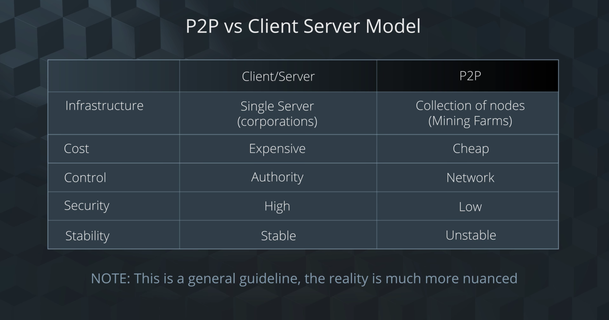
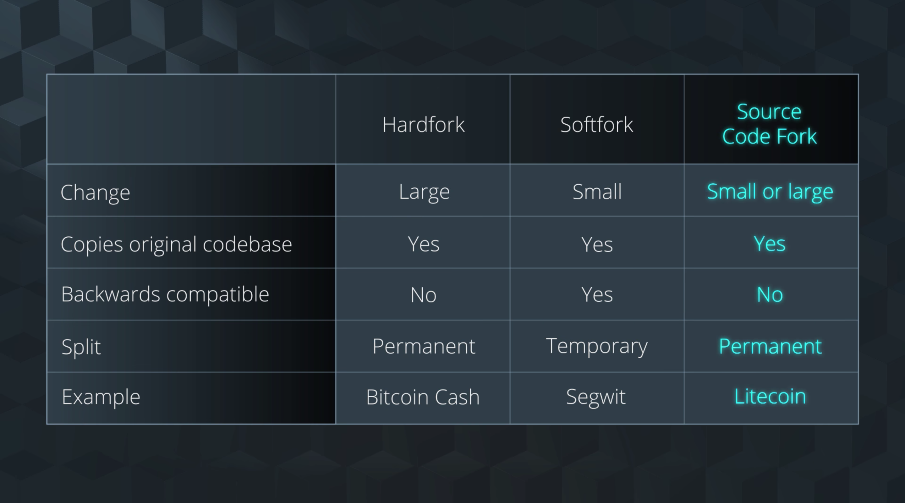
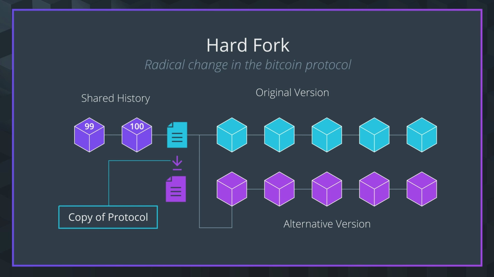
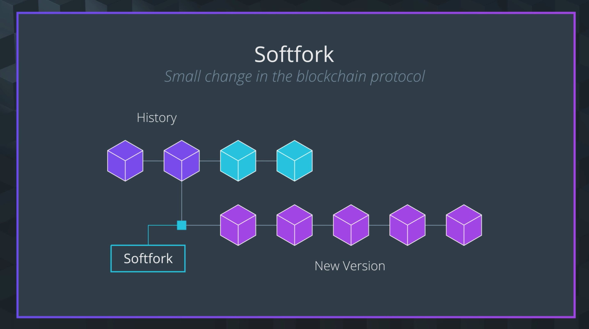
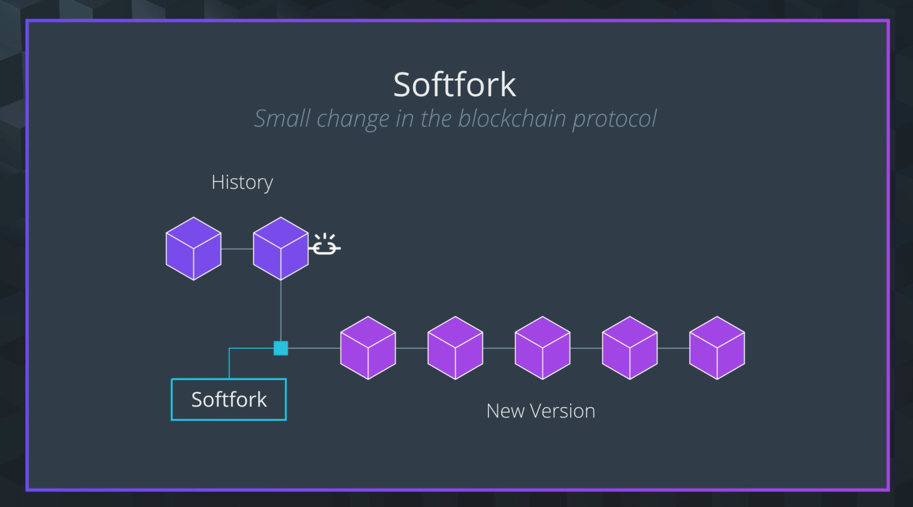
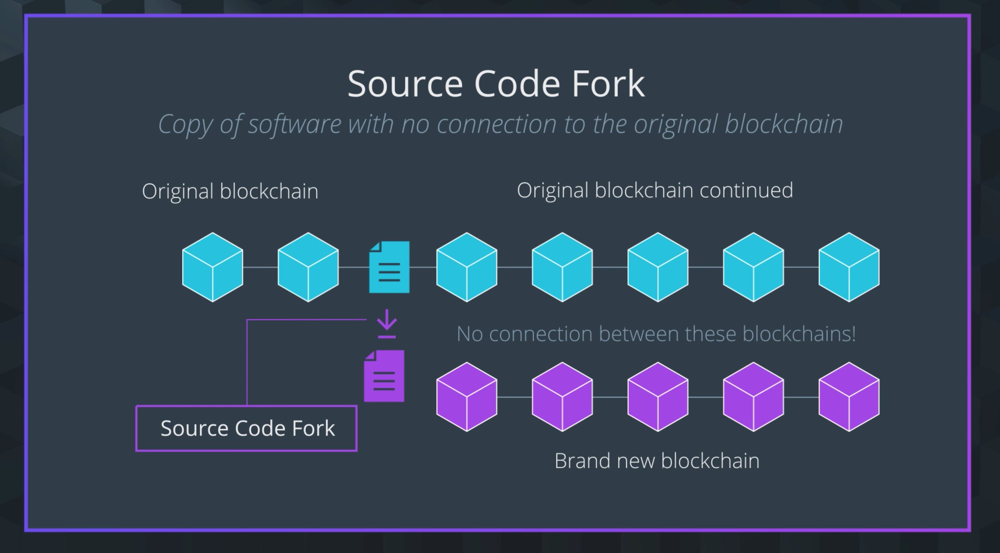

# 1. Lesson Overview

## Blockchain Data Overview

Lesson Objective: : Be able to describe general concepts of a blockchain dataset.

## Concepts

- Blockchain as a Dataset: Differentiate the pros and cons of the blockchain as a dataset
- Blockchain Use Cases: Determine whether or not an application could benefit from using a blockchain.
- Explore Bitcoin Data: Explore bitcoin block data using the debug log console
- P2P Network vs Client-Server Model: Compare and contrast peer-to-peer network vs the client server model.
- Mining the Blockchain Dataset: Demonstrate how the mining process controls the state of the chain.
- Explore the Code for Mining: Explore bitcoin code that allows for mining Bitcoin Improvement Proposals: Describe the bitcoin improvement proposal process.
- Softfork vs Hardfork: Discuss the details of softforks and hardforks using examples.

# 2. Interview: Blockchain as a Dataset

## Blockchain Data Model
## Blockchain vs Traditional Databases
## Wrap Up

# 3. Blockchain vs Traditional Database

## Blockchain as a Dataset

The goal of this section is to help you differentiate the pros and cons of the blockchain as a dataset. This will allow you determine if certain use cases need a blockchain, or if a different solution might be more effective.

To do that, we'll cover what we mean by the blockchain as a dataset, define what we mean by a traditional database, then compare and contrast the characteristics of each of these.

## Traditional Database Characteristics

Database: Collection of information organized to allow easier access and management.

A blockchain is a type of database.

How do you know when a blockchain is the right type of database and when it might not be the best solution?

### 5 characteristics of traditional database

Network: Centralized
Functions: Create, Read, Update, Delete (CRUD)
Mutability: Mutable
Authorization: Centralized
Transparency: Low

### Centralized Network

- Remains with authority
- Requires Authentication

### Mutable Data

Data that can be updated after being added to the database.

## Blockchain Characteristics
## Traditional Database vs Blockchain

1 CRUD
2 Append and Validate
3 Mutable
4 Immutable
5 Low
6 High

## Wrap Up

# 4. Do You Need a Blockchain?

## Do you need a Blockchain?
## Blockchain Questions Overview
## 5 Questions from video

Here are 5 questions from the video above to help you determine if a blockchain is right for your situation. Remember, answering yes to any one of them doesn't necessarily mean a blockchain is the right solution, but if you can answer yes to ALL OF THEM then a blockchain might be appropriate for your application.

- Do you need a database?
- Does it require shared write access?
- Will you need to create the trust between users?
- Can you operate without trusted 3rd parties?
- Can you operate without control over permissions?
- Try using these questions to help you come up with 

solutions for the scenarios listed below.

## Problem Set: Blockchain Scenarios

### Q1

Electronic voting (also known as e-voting) refers to voting using electronic means to either aid or take care of the chores of casting and counting votes.

- [x] Blockchain

Correct! A blockchain is an wonderful option for electronic voting.
In the same way that blockchain acts as a public ledger for Bitcoin, it can also create a permanent and public ledger for votes.

### Q2

Social network which depends on centralized control similar to Facebook.

- [x] No Blockchain

Correct! Social network similar to Facebook depends on centralized services operating with control over permissions.

## Wrap Up

In this section, we went over a set of questions you can use to decide if a blockchain is the right solution for your application.

This is a great start! There's something we haven't mentioned yet though. Once you decide that a blockchain is the right solution, it's time to decide which TYPE of blockchain would be most effective.

There are 3 types of blockchains public, private, and hybrid. In the next section, we'll look at each of these blockchain types in more depth and cover a few more questions you can use to decide which one is right for you.

# 5. Blockchain Types

## Blockchain Types Overview

public, private, and hybrid

## Resources

## Choose a Blockchain Type
## 3 Questions from video

- Will transactions be public?: public
- Will other companies need access to your data?: private
- Should some information be public while other information is restricted?: hybride

## Wrap Up

Similar to how we compare the blockchain database to a traditional database, we'll compare the blockchain peer-to-peer network to the traditional client-server model.

# 6. Interview: Blockchain Types
# 7. P2P Network vs Client-Server Model

## P2P Network vs Client-Server Model Overview
## P2P Network vs Client-Server Model

compare them based on 5 characteristics; infrastructure, cost, control, security, and stability.

## Problem Set: P2P or Client-Server?
## Wrap Up

### Q1

You’d like to have control over the information of the database so that you can easily assign permissions to different users. Which model should you use?

> Client-Server Model

### Q2

You need a network that is very stable and you need control to either add or remove computation and storage depending on the clients. Which model should you use?

> Client-Server Model

### Q3

Security is important, but you do not want a central authority controlling permissions across the network. Which model should you use?

> P2P Network

### Q4

You want a model where decisions are made by nodes in the network as opposed to central entities. Which model should you use?

> P2P Network

### Q5

A large movie streaming site owns many servers to ensure if one of the servers fails, there are other servers on which to fall back on so the information is not lost. Which model does this describe?

> Client-Server Model

This scenario describes what is called the failover system built into the Client-Server Model. You can read more about it .

# 8. Explore Blockchain Data

## Explore Blockchain Data
## Explore Blockchain Data with a Block Explorer

https://blockexplorer.com/

## Explorer Blockchain JSON Data

## Problem Set: Blockchain Data

### Q1

When reviewing Blockchain data, what does the block height mean within the header of a block?

- [] Seed of a node
- [] Memory Pool
- [x] Block number in the chain
- [] Block proxy identifier

With Blockchain, each block is linked within the chain. Using the block number is a great way to have an identifier for reference to the block.

### Q2

When reviewing Blockchain header data, which of the following fields contribute to block immutability?

- [x] Previous Hash
- [x] Nonce
- [x] Bits
- [x] Time Stamp
- [] Null

Previous hash, nonce, bits, and time stamp help assist in block immutability in the chain. If one is modified after inclusion into the chain, the block hash would be invalid which would break the chain.

## Wrap Up

# 9. Practice Block Data

# 10. Explore Bitcoin's Codebase

## Explorer Bitcoin's Codebase

github.com/bitcoin/bitcoin

## Problem Set: Bitcoin Codebase

What is the value of the original seed: pszTimestamp?
What is the value of consensus.nSubsidyHalvingInterval ?
What are the values of consensus.nPowTargetTimespan and consensus.nPowTargetSpacing, respectively?

## Wrap Up

# 11. BIPs ans Forks

## Bitcoin Improvement Proposals

## Hardforks

The different types of forks are hardforks, softforks, and source code forks.

These are all implemented in a similar way, but the outcome can be drastically different depending on which type of fork it is.

## Softforks

## Source Code Forks

## Bitcoin is to Gold as Litecoin is to Silver

In the last video, we covered Litecoin, a source code fork to Bitcoin. This an interesting alternative coin to Bitcoin that we wanted to provide more information on. If you'd like, take some time to read through this information, then check out their code base.

Litecoin was created by Charlie Lee on October 7, 2011. He designed Litecoin with the vision that it would be better suited for smaller, less expensive transactions.

When Bitcoin was created, the longer block times was an added layer of security (wait for 6 confirmations or 6 blocks before the transaction is endorsed) which was perfect for high-end, large transactions such as purchasing a car or laptop, but Lee believed that for smaller transactions it was not necessary. Litecoin could provide a similar service as Bitcoin, but would be was better tailored for smaller, less expensive transactions.

Because of these characteristics, Litecoin is nicknamed the “silver” because silver is more available than the gold standard Bitcoin; it has faster transaction times an its difficulty of the mining algorithm also adjusts more often.

In exploring Litecoin’s (LTC) codebase, you may have noticed that many of its parameters are related to Bitcoin’s by a factor of 4.

For example, the Proof of Work algorithm adjusts in difficulty every 3.5 days in Litecoin versus 14 days in Bitcoin and in the Litecoin network, a new block can be expected about every 2.5 min while in Bitcoin it’s every 10 min.

Additionally, there’s 21 million Bitcoins that can be mined total whereas there’s 4 times that amount of Litecoin, 84 million Litecoins will ever be able to exist in the world.

## Wrap Up

# 12. Quiz: Softfork vs Hardfork

## Q1

Blocks Violating the New Rule are made stale by the upgraded mining majority

> Hardfork

## Q2

Non-upgraded Node Rejects the new Rule resulting in a Diverging Chain.

> Softfork

## Q3

Which type of forking doesn’t require any nodes to upgrade to maintain consensus since all blocks with the new forked in rules also follow the old rules, therefore old clients accept them. Also, this type of forking cannot be reversed.

> Softfork

## Q4

Litecoin is considered to be which type of forking?

> Software fork

# 13. Interview: How to Get Involved
# 14. Lesson Summary

블록체인을 데이터베이스관점으로 보면 퍼블릭 프라이빗 하이브리드 vs 트레디셔널 디비

블록체인을 네트워크관점으로 보면 p2p network vs client-server model

12에 q3 캔낫비리버서드 틀린거 맞지?

A softfork differs from a hardfork in that the new version of software is 'optional' whereas a hardfork would require all nodes to be running the new changes in order to be considered part of the network. A softfork includes changes that can take effect on only a subset of the transactions/blocks while performing old logic on the rest.

Imagine that you pushed a new change to the protocol that included a new way validate transactions very, very quickly but in order for this new method to work, the transactions would have be crafted slightly different as well. In a softfork situation, your node could look at all incoming transactions and any that were crafted in the new format could be verified in using your new trick while those that were crafted in the old format were still able to be verified/validated using the older more slow method.

In this way, not every node on the network needs to start crafting their transactions in the new form -- your node software doesn't care -- because it can handle both. And it can handle both because both types of transactions are able to be bundled into a block no matter their form.

If you had a change that wouldn't work unless every single transaction you ever saw was in the new form, you'd have a hardfork situation on your hand.