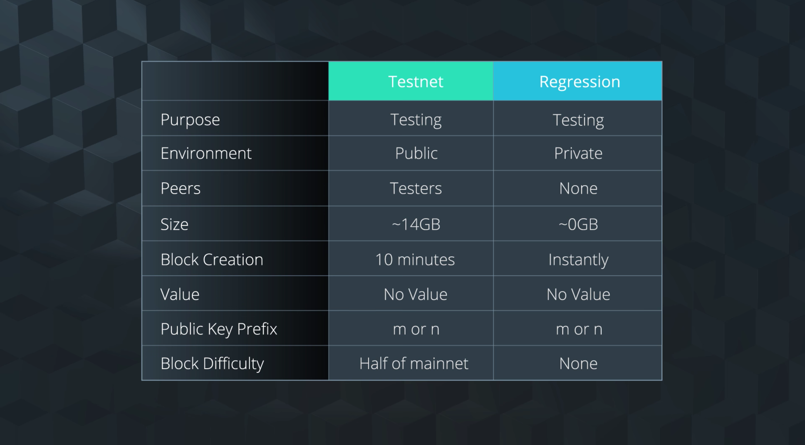

Learn the benefits of utilizing the Bitcoin Core testnet. Also, understand the difference between the public testnet

# 1. Lesson Introduction
# 2. Bitcoin Core Motivation
# 3. Bitcoin Core - Overview

Until now, We considered `Bitcoin` as a network.
From now on, We consider `Bitcoin` as a software.

## Objective

Differentiate between bitcoin and bitcoin core and understand how they are used by developers.

## Key Terms

- Bitcoin: Network of bitcoin users creating and validating transactions
- Bitcoin Core: Implementation of bitcoin that encompasses all of the software behind bitcoin(Bitcoin-QT, Satochi client, Bitcoin Core 모두 동일한걸 지칭)
- Debug Console: Tool that allows you to interact with data on the bitcoin blockchain

# 4. Bitcoin Core - Networks

## Key Terms

- Bitcoin Mainnet: Primary Network where live transactions take place
- Bitcoin Testnet: Alternative Bitcoin blockchain that provides a test environment for applications
- Bitcoin Regnet: Alternative test network for testing bitcoin applications(reg: regression test mode. for speed up testing. You can instantaneously create new blocks and have complete control over the environment that you're testing in)


# 5. Mainnet vs Testnet

## Recap


### Additional Resources

Learn more about the [Bitcoin Wiki Testnet](https://en.bitcoinwiki.org/wiki/Testnet)
Checkout some Bitcoin [Developer Test Application Examples](https://bitcoin.org/en/developer-examples#testing-applications)

# 6. Testnet vs Regression Testing



# 7. Data Wranglings and Bitcoin.config Setup

At this point, we've talked a lot about the Bitcoin Core Software.

## Requirements and Warnings

[Requirements and Warnings](https://bitcoin.org/en/bitcoin-core/features/requirements)

## Alternatives

We understand that this may not be a viable option for many people. Below we have provided alternatives that can help you get started even if you are unable to install Bitcoin Core.

### Workspaces

We have a Bitcoin Core Full node installed in the classroom that you can access using a command line interface.

You can type commands directly into this console, and you’ll get the same values as if you had run it locally.

Anytime you see something that looks like the image below in the classroom, that's a workspace!

It's an interactive terminal environment you can use to run commands in. We’ll be going into these commands in the next lesson when we review the Bitcoin Core Debug Console.

### Switching Networks

While the workspaces can help with running commands, they don’t give you access to the user interface of the wallet provided by Bitcoin Core.

To get access to these you’ll need to get onto a network somehow.

One way to make this more manageable is to run the software with certain modifications.

One change is to set the default network to be the testnet or regnet.

If you do this, rather than the software syncing to the mainnet, which can be up to 200GB or more, you’ll sync to the testnet which is approximately 15GB, or the regnet which is 0GB.

If you choose this option, download the software as shown in the next section, then jump directly to Bitcoin Core Networks Demonstration to see how to switch to a different network.

### Pruning

As a quick summary here are the steps you’ll go through.
- Step 1: create a bitcoin.conf file in your blockchain directory.
- Step 2: In this file, write prune=550.

## Final Note

We understand this is a significant hurdle to becoming a Blockchain Developer.

We’ve chosen to follow through with Bitcoin as our starting point because it is an excellent way to get started with the core concepts that persist throughout all Blockchain technologies you will come across.

Bitcoin was not only the first blockchain, it was the starting point from which the components, terminology, concepts for all other blockchains derived.

We hope that you see the value in starting with this software, and will continue to do everything we can do make sure you can comfortably get started no matter what restrictions you may have to your local environment.

Thank you, please reach out if you have any questions or concerns about this.

# 8. Bitcoin Core - Getting Started

## Bitcoin Core Version

https://bitcoincore.org/bin/bitcoin-core-0.16.3/

Bitcoin Core version 0.16 was the latest version available while making this lesson.

## Overview

Set up the Reference Client Bitcoin Core on their desktop.

## Key Terms

- Bitcoin Full Node Wallet: A bitcoin wallet that fully validates transactions and blocks

## Links

- [Bitcoin Core version 0.16.3](https://bitcoincore.org/bin/bitcoin-core-0.16.3/)
- Need help finding where the Bitcoin data file is stored by default? [Check here](https://en.bitcoin.it/wiki/Data_directory)

## Notes

You can using pruning to reduce the amount of space taken by the bitcoin blockchain.

- Step 1: Create a bitcoin.conf file in your blockchain data directory. Find where Bitcoin creates its default data directory depending on your OS here.
- Step 2: In the bitcoin.conf file, write prune=550 and save file.

This will not make blockchain sync faster. It will make it take less space, though, which can be helpful.

See more here: [Full Node: Reduce Storage](https://bitcoin.org/en/full-node#reduce-storage)

# 9. Bitcoin Core - Wallet Overview

## Recap
## Resources

Did you download Bitcoin Core and need help finding where the Bitcoin data file is stored on your computer by default? Check this wiki about [Data directory](https://en.bitcoin.it/wiki/Data_directory).

# 10. Bitcoin Core - Network Demonstration

Switch to Testnet(2 ways)
- Run the client with a Testnet flag
- Use a bitcoin clnfiguration file (preferred)

How to?

```conf
# This is bitcoin.conf file
# /Users/sanghkaang/Library/Application Support/Bitcoin/bitcoin.conf
#testnet=1 # uncomment if you want testnet
#regtest =1 # uncomment if you want regtest 
# if you want mainnet, comment all or delete all or delete bitcoin.conf file
```

## Recap

In this section, we discussed when to use each Bitcoin Core Network and how navigate between them.

## Key Terms

- Bitcoin Mainnet: Primary Network where live transactions take place
- Bitcoin Testnet: Alternative Bitcoin blockchain that provides a test environment for applications
- Bitcoin Regnet: Alternative test network for testing bitcoin applications

## Access Networks

- Access testnet: testnet = 1 in bitcoin.conf file
- Access regnet: regtest = 1 in bitcoin.conf file

##Links

- [Testnet Wiki](https://en.bitcoin.it/wiki/Testnet)
- [How to activate the Bitcoin core testnet](https://www.youtube.com/watch?v=CxDSrYuzmyQ)
- [How to use bitcoin testnet](https://www.youtube.com/watch?v=MX_DHGJxoOc)
- [Testnet bitcoin](https://www.youtube.com/watch?v=WgNhwExy_cM)
- [Testnet and faucets](https://www.youtube.com/watch?v=gIZCQUatkes)
- [Bitcoin.conf friendly generator](https://jlopp.github.io/bitcoin-core-config-generator/)
- [Bitcoin.conf overview](https://www.youtube.com/watch?v=W54aRszkEOI&t=32s)

# 11. Get Testnet Coins

## Resource

Get your coins from the [Bitcoin TestNet Sandbox Faucet](http://bitcoinfaucet.uo1.net/)

# 12. Testnet Wallet Transactions

## Testnet Wallet Transaction
## Upcoming Steps

- Step 1: Find your Wallet
- Step 2: Create New Wallets
- Step 3: Set up Bitcoin.config file
- Step 4: Open Receiving Wallet
- Step 5: Get Receiving Address
- Step 6: Switch to sending Wallet
- Step 7: Get Testnet Coins
- Step 8: Make a Transaction
- Step 9: Check Transaction in Receiving Wallet

## Step 1: Find your Wallet

- Navigate into the folder that contains all of your bitcoin core files.
- Within the main folder, you’ll see one labeled testnet3.
- Go into this folder and look for the sub-folder labeled wallets.

What you should see is a file named wallet.dat. This is the main file that stores all of the information for your wallet.

## Step 2: Create New Wallets

- For this example, duplicate this wallet 2 times.
- Rename one of the copies sending.dat
- Name the other copy receiving.dat.

## Step 3: Set up Bitcoin.config file


- wallet = sending.dat
- wallet = receiving.dat

## Step 4: Open Receiving Wallet

- #wallet = sending.dat


Once you’re in, you can check the wallet name by going to the debug console and typing in getwalletinfo.

This shows us all the wallet information, and most importantly for right now, we can see that our wallet name is receiving.dat.

## Step 5: Get Receiving Address

- To get one Go to file > receiving addresses > new address
- Then copy the address and put it somewhere like a text document.


## Step 6: Switch to sending Wallet

- In the bitcoin config file, remove the comment from the sending wallet and add it to the receiving wallet.
- Now restart the application again.
- wallet = sending.dat
- #wallet = receiving.dat

Once inside the wallet, head back to the debug console and check the name of the wallet using getwalletinfo.

Looks like we’re in the sending wallet just like we wanted.

The problem now is that we don’t have any coins to send.

To get some, we can go back to the public faucet and request coins like we did before.

## Step 7: Get Testnet Coins

- To get testnet coins go to [Testnet Faucet](http://bitcoinfaucet.uo1.net/)
- Create and copy a receiving address for this wallet and request coins from the faucet.
- Soon you should have some testcoins that we can send over to our receiving wallet.
- You can check the overview tab to see both the transaction and the new balance.

## Step 8: Make a Transaction

- Go to the send tab and paste in the receiving address you had stored from your receiving wallet.
- Add in a label, an amount, and a transaction fee if you’d like.

## Step 9: Check Transaction in Receiving Wallet

The transaction is done, and we could stop here, but it’ll be nice to see if the transaction has been received by the receiving wallet.

To do this, we need to switch wallets just like before.

- Make the small changes to the bitcoin config file and restart the application.

## Wrapping Up


# 13. Bitcoin Core v0.17: Wallet Creation and Coin Transfer
# 14. Block Explorer

[BlockCypher Block Explorer](https://live.blockcypher.com/btc-testnet/)

# 15. End of Lesson Motivation
# 16. Lesson Recap

## In This Lesson

- Discussed an overview of the Bitcoin Core Networks
- Compared Mainnet, Testnet, and Regnet
- Setup a Bitcoin Core Full Node Wallet
- Obtained Testnet Coins
- Completed and Explored a Transaction

## What's Next?

Getting comfortable with these tools will help you to complete the next project where you‘ll build your own private blockchain. In the next lesson, you’ll build on these skills and use commands in the debug console to explore components of the blockchain.

When you’re ready we’ll see in you the lesson!
