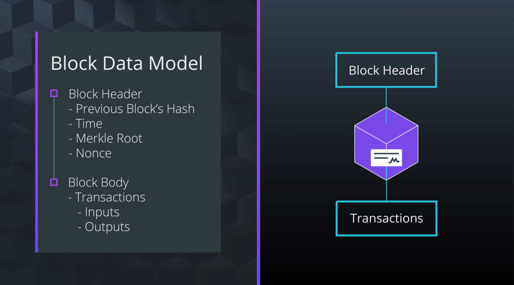
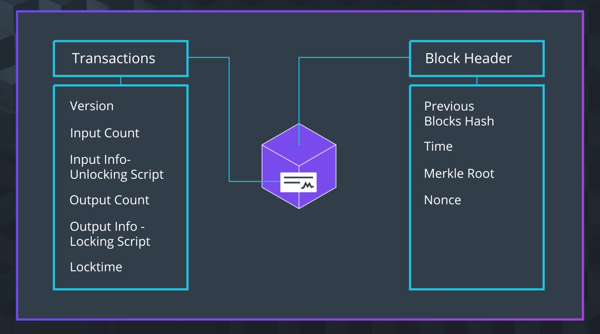
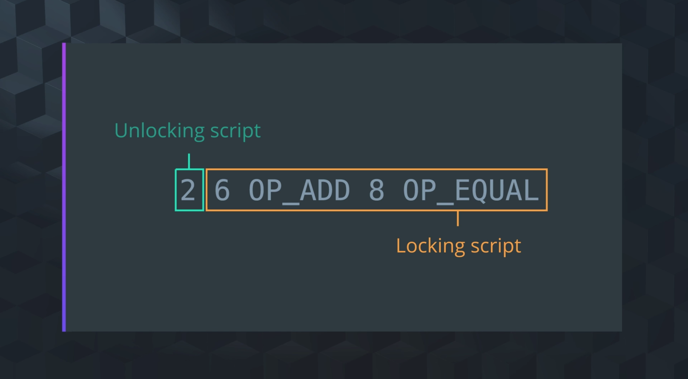
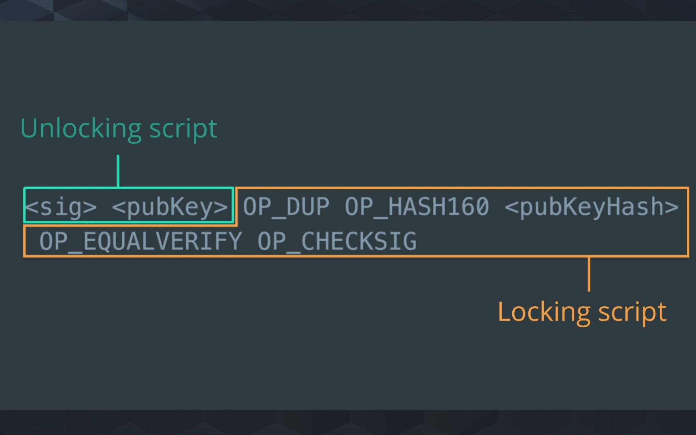

# 1. Lesson Overview

## Lesson Introduction

In this lesson, you'll use Bitcoin Core to explore the limitations and best practices when `embedding data in blockchain transactions`.

### By the End of This Lesson...
You will be able to...

- Recognize the data structure of blocks and transactions.
- Recognize the purpose of Bitcoin Script opcodes that are commonly used in the input and output parts of a transaction process.
- Explore the limitations and best practices of embedding data in blockchain transactions.

# 2. Blockchain Data Motivation

# 3. Blockchain Data Models Overview

## Block Data Model Recap



### Block Header

- Previous Block’s Hash - The hash value for the block that comes directly before a given block in the chain. This is what links blocks in the blockchain together
- Time - The time the block was created is also held in the header
- Merkle Root - The merkle root is a hash that represents every transaction included inside the block. To get the merkle root, pairs of transactions within a block are repeatedly hashed together. Each pair results in a single hash. Then the hash of 2 pairs of transactions are again hashed together, over and over again until you are left with a single hash value. Given that final hash value, known as the merkle root, you can now use the hash to search the original transactions or hash values that created them. This searching allows you to find the original transactions that made up the block when starting from this single hash value.
- Nonce - A nonce (stands for “number only used once") is a number used in bitcoin mining. The blockchain miners are solving for the nonce what when added to a hashed block, and those 2 values are rehashed, will solve the mining puzzle.

### Block Body (will be covered in this lecture)

- Transaction
    - Inputs
    - Outputs

# 4. Transactions - Inputs and Outputs

## Summary

Transactions encode the transfer of value between participants in the system. In more detail, a transaction is a data structure that encodes a transfer of value from a source of funds called an “input” to a destination called an “output”.

Inputs in one transaction are just the unspent outputs from another transaction. All inputs reference back to an output. Unspent Outputs is sometimes short-handed to UTXO.


Inputs in one transaction are just the unspent outputs from another transaction.

Conceptualize the arrow as a pointer from the inputs referencing the outputs from which they came. This is similar to pointers in a linked list. You’ll find that this is standard arrow notation, inputs pointing back to their outputs.

In the next section we will see how these components are stored in a Transaction Data Model.

# 5. Transaction Data Models

https://youtu.be/ukArkoSPbT8

This is the Raw Transaction we explored in the video:

0100000001f3f6a909f8521adb57d898d2985834e632374e770fd9e2b98656f1bf1fdfd427010000006b48304502203a776322ebf8eb8b58cc6ced4f2574f4c73aa664edce0b0022690f2f6f47c521022100b82353305988cb0ebd443089a173ceec93fe4dbfe98d74419ecc84a6a698e31d012103c5c1bc61f60ce3d6223a63cedbece03b12ef9f0068f2f3c4a7e7f06c523c3664ffffffff0260e31600000000001976a914977ae6e32349b99b72196cb62b5ef37329ed81b488ac063d1000000000001976a914f76bc4190f3d8e2315e5c11c59cfc8be9df747e388ac00000000

Transaction in the bitcoin blockchain are stored in a double-hashed form:

SHA256(SHA256(01000…)) = b138360800cdc72248c3ca8dfd06de85913d1aac7f41b4fa54eb1f5a4a379081

View this transaction in a block explore [here](https://live.blockcypher.com/btc/tx/b138360800cdc72248c3ca8dfd06de85913d1aac7f41b4fa54eb1f5a4a379081/).

Raw Transaction with each component highlighted:




# 6. Bitcoin Scripts

## Demo Transaction Information

**Raw transaction**:

0100000001f3f6a909f8521adb57d898d2985834e632374e770fd9e2b98656f1bf1fdfd427010000006b48304502203a776322ebf8eb8b58cc6ced4f2574f4c73aa664edce0b0022690f2f6f47c521022100b82353305988cb0ebd443089a173ceec93fe4dbfe98d74419ecc84a6a698e31d012103c5c1bc61f60ce3d6223a63cedbece03b12ef9f0068f2f3c4a7e7f06c523c3664ffffffff0260e31600000000001976a914977ae6e32349b99b72196cb62b5ef37329ed81b488ac063d1000000000001976a914f76bc4190f3d8e2315e5c11c59cfc8be9df747e388ac00000000

**Transaction in the bitcoin blockchain are stored in a double-hashed form**: SHA256(SHA256(01000…)) = b138360800cdc72248c3ca8dfd06de85913d1aac7f41b4fa54eb1f5a4a379081

View this transaction in a block explorer [here](https://live.blockcypher.com/btc/tx/b138360800cdc72248c3ca8dfd06de85913d1aac7f41b4fa54eb1f5a4a379081/)

## Here is a breakdown of the Raw Transaction.


- Version - All transactions include information about the Bitcoin Version number so we know which rules this transaction follows.
- Input Count - Which is how many inputs were used for this transaction
- **Data stored in Input information:**
    - Previous output hash - All inputs reference back to an output (UTXO). This points back to the transaction containing the UTXO that will be spend in this input. The hash value of this UTXO is saved in a reverse ordered here.
    - Previous output index - The transaction may have more than one UTXO which are referenced by their index number. The first index is 0.
    - Unlocking Script Size - This is the size of the Unlocking Script in bytes.
    - Unlocking Script - This is the hash of the Unlocking Script that fulfills the conditions of the UTXO Locking Script.
    - Sequence Number - This s a deprecated feature of bitcoin Currently set to ffffffff by default.
- Output Count - which tells us how many outputs were produced from this transaction.
- **Data stored in Output Information:**
    - Amount - The amount of Bitcoin outputted in Satoshis (the smallest bitcoin unit). 10^8 Satoshis = 1 Bitcoin.
    - Locking Script Size - This is the size of the Locking Script in bytes.
    - Locking Script - This is the hash of the Locking Script that specifies the conditions that must be met to spend this output.
- Locktime - The locktime field indicates the earliest time or the earliest block a transaction can be added to the blockchain. If the locktime is non-zero and less than 500 million, it is interpreted as a block height and miners have to wait until that block height is reached before attempting to add it to a block. If the locktime is above 500 million, it is read as a unix timestamp which means the number of seconds since the date January 1st 1970. It is usually 0 which means confirm as soon as possible.    

## Code Examples
- Example of scriptPubKey used bitcoin source code’s [wallet.cpp file](https://github.com/bitcoin/bitcoin/blob/master/src/wallet/wallet.cpp#L847)
- Example of scriptSig in bitcoin source code’s [wallet.cpp file](https://classroom.udacity.com/nanodegrees/nd1309/parts/31b86083-85e4-43ae-b154-6905b461f2c1/modules/0af5bc78-b446-4b60-b9cd-8659536cd59f/lessons/970128bc-c405-4a22-8fed-d3f56d5dfac1/concepts/ADD%20LINK)


# 7. Script Opcodes




## Resources

[List of Bitcoin opcodes](https://en.bitcoin.it/wiki/Script)

# 8. Quiz: Opcodes

Which Unlocking Script (scriptSig) will satisfy this Locking Script (scriptPubKey)?

Locking Script: OP_ADD 2 OP_MUL 1 OP_ADD 11 OP_EQUAL

- [] 3 1
- [] 7 0
- [x] 2 3
- [] 5 9

## Standard Script Notation

Let’s discuss standard script notation using this example,`<sig><pubKey> OP_CHECKMULTISIG`

- Bracketed values are data to be pushed to the stack.
    - For example, `<sig>`.
- Non-bracketed words are opcodes.
    - For example, `OP_CHECKMULTISIG`
- Sometimes you may see the `OP` prefix omitted.
    - For example, `<sig><pubKey> OP_CHECKMULTISIG` may be abbreviated to `<sig><pubKey> CHECKMULTISIG`

## Exploring Live Scripts

Using an online block explorer, we can see examples of live Unlocking and Locking Scripts.

Step 1. Checkout this [TXID: 56beef8afe5a4b5b41225211e62c3e7bce5747c4c8dcdd982173e8496687794b](https://blockchain.info/tx/56beef8afe5a4b5b41225211e62c3e7bce5747c4c8dcdd982173e8496687794b) that has 1 input and 2 outputs.


Step 2: Scroll down to the bottom to see the Unlocking Scripts (scriptSig) of the one input and the two Locking Scripts (scriptPubKey) from the two outputs.


Step 3: Focus on the Locking Script of the first Output (output 0):


The generic form of this script is:

`OP_DUP OP_HASH160 <pubKeyHash> OP_EQUALVERIFY OP_CHECKSIG`

Step 4: Now focus on the Unlocking Script of the Input:


The generic form of this script is:

`<sig> <pubKey>`

Which is a Standard Unlocking Script for Standard Transactions to Bitcoin addresses.

That wraps it up for your overview to Script Opcodes. In this concept, we:

- Demoed how to evaluate an example script and you got to practice solving an example
- Saw some examples of simple Unlocking and Locking Scripts
- Reviewed standard script notations
- Explored live scripts using an online block explorer

# 9. Attributes of Script

Attributes of Scripts
- Not Turing Complete
- Stateless Verification

Not Turing Complete
- No loops or complex flow control
- Completely deterministic
- Provides simplicity and security

Stateless Verification
- No state saved prior to or after the script sxecutes
- Script is self-contained
- Provides predictability no matter where script is executed

# 10. Raw Transaction Review

We’ve seen transactions stored on the blockchain by their Transaction Hash.


Transactions stored in the bitcoin blockchain are stored in a double-hashed form.

This means the raw transaction was put through SHA256 twice to get the Transaction hash we see on the blockchain.


For example, a transaction with this hash: b138360800cdc72248c3ca8dfd06de85913d1aac7f41b4fa54eb1f5a4a379081

Transaction in the bitcoin blockchain are stored in a double-hashed form: SHA256(SHA256(01000…) = b138360800cdc72248c3ca8dfd06de85913d1aac7f41b4fa54eb1f5a4a379081


Given the raw transaction, we were able to see more details about the Transaction Data model.


We discussed that inside the Input Information section and Output Information section there’s data about an Unlocking Script and Locking Script, respectively.

What we didn’t mention is that there’s a little bit more than that inside each of these sections. Let’s see what else is contained here.


The input information section contains these pieces of data:

- Previous output hash - All inputs reference back to an output (UTXO). This points back to the transaction containing the UTXO that will be spend in this input. The hash value of this UTXO is saved in a reverse ordered here.*
- Previous output index - A transaction may have more than one UTXO which are referenced by their index number. The first index is 0.
- Unlocking Script Size - This is the size of the Unlocking Script in bytes.
- Unlocking Script - This is the hash of the Unlocking Script that fulfills the conditions of the UTXO Locking Script.
- Sequence Number - This s a deprecated feature of bitcoin Currently set to ffffffff by default.

*Remember that all inputs reference back to an output (UTXO). This points back to the transaction containing the UTXO that will be spend in this input. The hash value of this UTXO is saved in a reverse ordered here.


Similarly, here’s the data stored in the Transaction Output Information:

- Amount - The amount of Bitcoin outputted in Satoshis (the smallest bitcoin unit). 10^8 Satoshis = 1 Bitcoin.
- Locking Script Size - This is the size of the Locking Script in bytes.
- Locking Script - This is the hash of the Locking Script that specifies the conditions that must be met to spend this output.


Here is the full breakdown of the raw transaction:


Raw transaction breakdown

- Version - All transactions include information about the Bitcoin Version number so we know which rules this transaction follows.

- Input Count - Which is how many inputs were used for this transaction

Data stored in Input information:
    - Previous output hash - All inputs reference back to an output (UTXO). This points back to the transaction containing the UTXO that will be spend in this input. The hash value of this UTXO is saved in a reverse ordered here.
    - Previous output index - The transaction may have more than one UTXO which are referenced by their index number. The first index is 0.
    - Unlocking Script Size - This is the size of the Unlocking Script in bytes.
    - Unlocking Script - This is the hash of the Unlocking Script that fulfills the conditions of the UTXO Locking Script.
    - Sequence Number - This s a deprecated feature of bitcoin Currently set to ffffffff by default.

- Output Count - which tells us how many outputs were produced from this transaction.

Data stored in Output Information:
    - Amount - The amount of Bitcoin outputted in Satoshis (the smallest bitcoin unit). 10^8 Satoshis = 1 Bitcoin.
    - Locking Script Size - This is the size of the Locking Script in bytes.
    - Locking Script - This is the hash of the Locking Script that specifies the conditions that must be met to spend this output.

- Locktime - The locktime field indicates the earliest time or the earliest block a transaction can be added to the blockchain. If the locktime is non-zero and less than 500 million, it is interpreted as a block height and miners have to wait until that block height is reached before attempting to add it to a block. If the locktime is above 500 million, it is read as a unix timestamp which means the number of seconds since the date January 1st 1970. It is usually 0 which means confirm as soon as possible.

# 11. Create Raw Transaction Motivation

## Motivation for Creating Transactions

Now that we know the parts of a raw transaction, let’s use the Bitcoin protocol to build our own raw transaction.

As discussed, you’ve seen the Bitcoin core wallet which allows us to leverage a lot of functionality of the Bitcoin Protocol but it does limit what we can do from the provided GUI.

To really leverage the full power of the protocol, we need to bypass the GUI and work directly with the protocol.

This will help you to know what commands to implement when building your own private blockchain.

## Motivation for the Project

Knowing this skill will help you when you’re building a private blockchain that can perform transactions and secure the block with a digital signature

Here are the steps we will take:

- Step 1 - View all unspent confirmed UTXO in the wallet
- Step 2 - View Details about a Specific UTXO
- Step 3 - Create a Raw Transaction
- Step 4 - Decode the Raw Transaction (to doublecheck it went through correctly)
- Step 5 - Sign the Raw Transaction
- Step 6 - Submit the Raw Transaction to the Network
- Step 7 - Query the TxID of the Transaction we sent

One thing to notice is that these steps follow the Transaction lifecycle flow we’ve seen before:


# 12. Create a Raw Transaction - Step 1

## Transaction Review

Bitcoin transaction inputs come from the outputs of a previous transaction. During a transaction, these funds are transferred from one address to another address. When it comes time to spend a transaction, our wallet scans the blockchain for any spendable UTXO that are tied to our wallet address.

**Note**: In a previous lesson [here](https://classroom.udacity.com/nanodegrees/nd1309/parts/c27351e7-b0ea-480c-bde9-a936817e4fe4/modules/0af5bc78-b446-4b60-b9cd-8659536cd59f/lessons/8abea3d8-b174-4f57-ad1d-03bc1bf0f68d/concepts/aaa10f87-54f7-4d4e-a142-db354895ad0a), we used our wallet to create a transaction from the GUI.

If your wallet doesn’t already have available transactions with outputs to spend, checkout the link above to setup a transaction so you have outputs to work with.

For this exercise, to create a raw transaction, we will use the outputs from that transaction as our starting point inputs.

### Environment Setup:

- Bitcoin Core version v0.16.0 (64-bit) Testnet
- Wallet Address (Yours will be different): 1hvzSofGwT8cjb8JU7nBsCSfEVQX5u9CL


## Step 1. View UTXO

In the debug console, use the [listunspent](http://chainquery.com/bitcoin-api/listunspent) command to show all the unspent confirmed outputs in our wallet. These can be used as inputs in another transaction.

### Execute Command

In the debug console type the listunspent command
`listunspent`

### Result

```json
[
 {
 "txid" : "e787a27bda32c8b54ee501be46d2cfcd47c1566c8ef6ee339bdb7cd5c82b701c",
 "vout" : 0,
 "address" : "2Mzxx8wGAmQQyCCrb2vXP4yxaYY9s9nepfy",
 "account" : "public faucet test",
"redeemScript": "0014c794ee65db89222f408dfe1728d214f2496d7a72"
 "scriptPubKey" : "a91454ad1e8953876c90d3fc15798c687835ab3d3aee87",
 "amount" : 0.05000000,
 "confirmations" : 12
 "spendable": true,
 "solvable": true,
 "safe": true
 }
...
]
```

- txid - This shows us that there is a Transaction with this id.
- vout - The Transaction has one output (vout at index 0).
- address - The Transaction is assigned to this address.
- account - This is a deprecated. It’s set to “ “ as a default.
- scriptPubKey - The hash of the Locking Script
- amount - Transaction amount in BTC
- confirmations - At the time of viewing this Tx, it has been confirmed 7 times (6 blocks added after it was added to the blockchain).

Using this information, we will can create a transaction that will spend the 0th vout (UTXO) of the txid as its input and assign it to a new output that sends value to a new address.

# 13. Create a Raw Transaction - Step 2

## Step 2. View Details about Specific UTXO

### Command
#### Command Parameters:

`gettxout "txid" n ( include_mempool )`

#### Arguments:

1. "txid" (string, required) The transaction id
2. "n" (numeric, required) vout number
3. "include_mempool" (boolean, optional) Whether to include the mempool. Default: true. Note that an unspent output that is spent in the mempool won't appear.

### Execute Command

To get the 0th index of the txid e787…

`gettxout e787a27bda32c8b54ee501be46d2cfcd47c1566c8ef6ee339bdb7cd5c82b701c 0`

### Result

```json
{
 "bestblock" : "00000000000000acd313062396a726f5ff6e5182522985c1a8a0286aaff536cd",
 "confirmations" : 13,
 "value" : 0.05000000,
 "scriptPubKey" : {
 "asm" : ""OP_HASH160 54ad1e8953876c90d3fc15798c687835ab3d3aee OP_EQUAL"",
 "hex" : "a91454ad1e8953876c90d3fc15798c687835ab3d3aee87",
 "reqSigs" : 1,
 "type" : "scripthash",
 "addresses" : [
 "2Mzxx8wGAmQQyCCrb2vXP4yxaYY9s9nepfy"
 ]
 },
 "coinbase" : false
}
```

We see more detailed information about this output, some which we’ve seen before from the listunspent command.

# 14. Create a Raw Transaction - Step 3

## Step 3. Create Raw Transaction

### Explanation

The transaction output we found has 0.050 BTC we can spend. We want to send 0.030 BTC to another wallet address.

Remember that we have to spend the whole output from a transaction and we will get the change back to our wallet (the wallet from which the value originated).

Finally, we also have to pay a transaction fee. In this case, we’ll pay 0.0005 BTC in fees. This fee will be reduced from our change (0.020 BTC - 0.0005 BTC = 0.0195 BTC).

To summarize:

Sum(Inputs) - Sum(Outputs) = Transaction Fee

(0.050 BTC) - (0.030 BTC + 0.0195 BTC) = 0.0005 BTC

In order for change to return back to us, we will need to create two outputs in our transaction, 0.30 and 0.0195 BTC, which will go in the `"address":amount` parameters. The remainder, 0.0005 BTC, will be the transaction fee.

### Command

[createrawtransaction command](http://chainquery.com/bitcoin-api/createrawtransaction)

#### Command Parameters:

```sh
createrawtransaction [{"txid":"id","vout":n},...] {"address":amount,"data":"hex",...} ( locktime ) ( replaceable )
```

#### Arguments:

1. "inputs"                (array, required) A json array of json objects
     [
       {
         "txid":"id",    (string, required) The transaction id
         "vout":n,         (numeric, required) The output number
         "sequence":n      (numeric, optional) The sequence number
       } 
       ,...
     ]
2. "outputs"               (object, required) a json object with outputs
    {
      "address": x.xxx,    (numeric or string, required) The key is the bitcoin address, the numeric value (can be string) is the BTC amount
      "data": "hex"      (string, required) The key is "data", the value is hex encoded data
      ,...
    }
3. locktime                  (numeric, optional, default=0) Raw locktime. Non-0 value also locktime-activates inputs
4. replaceable               (boolean, optional, default=false) Marks this transaction as BIP125 replaceable.
                             Allows this transaction to be replaced by a transaction with higher fees. If provided, it is an error if explicit sequence numbers are incompatible.

#### Result:

```
"transaction"              (string) hex string of the transaction
### Build Out Command
Let’s build out the command. To help us better visualize it, I’ll gather the parameter values and build out the command in a separate text editor Visual Studio:
```

```
// CREATE RAW TRANSACTION
TXID = Get this from listunspent command
VOUT = Get this from listunspent command
ADDRESS = Where will this amount be sent
AMOUNT = How much BTC will be sent
```

```
// Use the values you’ve collected above to fill in the createrawtransaction command
createrawtransaction '[{"txid":"TXID","vout": VOUT}]''{"ADDRESS":AMOUNT}'
```

### Execute Command

```sh
createrawtransaction '[{"txid": "e787a27bda32c8b54ee501be46d2cfcd47c1566c8ef6ee339bdb7cd5c82b701c", "vout":0}]' '{"2NFK8YHKT6hPPTDKTPP3c5bx7oPGrYhzj2y":0.030, "2Mzxx8wGAmQQyCCrb2vXP4yxaYY9s9nepfy":0.0195}'
```

Note: As mentioned above, this example has two outputs. The first is to send 0.030 btc to the receiving address. The second is to send 0.0195 btc as change back to the original wallet address.

### Result

```
02000000011c702bc8d57cdb9b33eef68e6c56c147cdcfd246be01e54eb5c832da7ba287e70000000000ffffffff02c0c62d000000000017a914f20fe211102535e3c37bb0e659099387ddc035b58730c11d000000000017a91454ad1e8953876c90d3fc15798c687835ab3d3aee8700000000
```

The output of createrawtransaction was a raw hex string of the transaction.

# 15. Create a Raw Transaction - Step 4

## Step 4. Decode Raw Transaction

### Explanation

The output of createrawtransaction was a raw hex string. We can confirm everything processed correctly by using the decoderawtransaction command.

### Command

We will use [decoderawtransaction](http://chainquery.com/bitcoin-api/decoderawtransaction).

#### Command Parameters:

`decoderawtransaction "hexstring"`

#### Arguments:

```
1. "hexstring"      (string, required) The transaction hex string
```

### Executed command

```
decoderawtransaction 02000000011c702bc8d57cdb9b33eef68e6c56c147cdcfd246be01e54eb5c832da7ba287e70000000000ffffffff02c0c62d000000000017a914f20fe211102535e3c37bb0e659099387ddc035b58730c11d000000000017a91454ad1e8953876c90d3fc15798c687835ab3d3aee8700000000
```

### Result

```
{
  "txid": "655419a854bdb808fb7cc3a68b8aab372e944ca028001ea247cead3ed00472eb",
  "hash": "655419a854bdb808fb7cc3a68b8aab372e944ca028001ea247cead3ed00472eb",
  "version": 2,
  "size": 115,
  "vsize": 115,
  "locktime": 0,
  "vin": [
    {
      "txid": "e787a27bda32c8b54ee501be46d2cfcd47c1566c8ef6ee339bdb7cd5c82b701c",
      "vout": 0,
      "scriptSig": {
        "asm": "",
        "hex": ""
      },
      "sequence": 4294967295
    }
  ],
  "vout": [
    {
      "value": 0.03000000,
      "n": 0,
      "scriptPubKey": {
        "asm": "OP_HASH160 f20fe211102535e3c37bb0e659099387ddc035b5 OP_EQUAL",
        "hex": "a914f20fe211102535e3c37bb0e659099387ddc035b587",
        "reqSigs": 1,
        "type": "scripthash",
        "addresses": [
          "2NFK8YHKT6hPPTDKTPP3c5bx7oPGrYhzj2y"
        ]
      }
    },
    {
      "value": 0.01950000,
      "n": 1,
      "scriptPubKey": {
        "asm": "OP_HASH160 54ad1e8953876c90d3fc15798c687835ab3d3aee OP_EQUAL",
        "hex": "a91454ad1e8953876c90d3fc15798c687835ab3d3aee87",
        "reqSigs": 1,
        "type": "scripthash",
        "addresses": [
          "2Mzxx8wGAmQQyCCrb2vXP4yxaYY9s9nepfy"
        ]
      }
    }
  ]
}
```

That checks out. Our new transaction used the UTXO from our confirmed transaction and generated 2 outputs - 0.030 BTC that was sent to the new address and 0.0195 BTC back as change. Any remainder, 0.0005 BTC, is used for the Transaction Fee.

Sum(Inputs) - Sum(Outputs) = Transaction Fee

(0.050 BTC) - (0.030 BTC + 0.0195 BTC) = 0.0005 BTC

# 16. Create a Raw Transaction - Step 5

## Step 5. Sign Raw Transaction

### Explanation

You may have noticed that in the output of decodetransaction, the scriptSig field is empty:

```
...
 {
      "txid": "e787a27bda32c8b54ee501be46d2cfcd47c1566c8ef6ee339bdb7cd5c82b701c",
      "vout": 0,
      "scriptSig": {
        "asm": "",
        "hex": ""
      },
      "sequence": 4294967295
    }
```

This is because we have not signed the transaction yet to prove that we own the address from which the UTXO were sourced.

### Command

In this section, we will use [signrawtransaction](http://chainquery.com/bitcoin-api/signrawtransaction) to sign the transaction.

#### Command Parameters:

```
signrawtransaction "hexstring" ( [{"txid":"id","vout":n,"scriptPubKey":"hex","redeemScript":"hex"},...] ["privatekey1",...] sighashtype )
```

#### Arguments

```
1. "hexstring"     (string, required) The transaction hex string
2. "prevtxs"       (string, optional) An json array of previous dependent transaction outputs
     [               (json array of json objects, or 'null' if none provided)
       {
         "txid":"id",             (string, required) The transaction id
         "vout":n,                  (numeric, required) The output number
         "scriptPubKey": "hex",   (string, required) script key
         "redeemScript": "hex",   (string, required for P2SH or P2WSH) redeem script
         "amount": value            (numeric, required) The amount spent
       }
       ,...
    ]
3. "privkeys"     (string, optional) A json array of base58-encoded private keys for signing
    [                  (json array of strings, or 'null' if none provided)
      "privatekey"   (string) private key in base58-encoding
      ,...
    ]
4. "sighashtype"     (string, optional, default=ALL) The signature hash type. Must be one of
       "ALL"
       "NONE"
       "SINGLE"
       "ALL|ANYONECANPAY"
       "NONE|ANYONECANPAY"
       "SINGLE|ANYONECANPAY"
```

### Build Out Command

Let’s build out the command. To help us better visualize it, I’ll gather the parameter values and build out the command in a separate text editor Visual Studio:

```
// SIGN RAW TRANSACTION
TRANSACTION HASH = Get from result of createrawtransaction command
TXID = Get from listunspent command
VOUT (optional) = Get from listunspent command
SCRIPT PUB KEY (optional) = Get from createrawtransaction command
PRIVATE KEY (optional) = Get from wallet
```

```
// Use the values you’ve collected above to fill in the signrawtransaction command
signrawtransaction 'TRANSACTION_HASH_HERE''[{"txid":"TXID_HERE","vout":VOUT_HERE,"scriptPubKey":"SCRIPT_PUB_KEY_HERE"}]''["PRIVATE_KEY"]'
```

### Execute Command

Note: If your wallet is encrypted, you will be asked to unlock it before you can sign a transaction.

```
signrawtransaction 02000000011c702bc8d57cdb9b33eef68e6c56c147cdcfd246be01e54eb5c832da7ba287e70000000000ffffffff02c0c62d000000000017a914f20fe211102535e3c37bb0e659099387ddc035b58760e316000000000017a91454ad1e8953876c90d3fc15798c687835ab3d3aee8700000000
```

### Result

```
{
"hex": "020000000001011c702bc8d57cdb9b33eef68e6c56c147cdcfd246be01e54eb5c832da7ba287e70000000017160014c794ee65db89222f408dfe1728d214f2496d7a72ffffffff02c0c62d000000000017a914f20fe211102535e3c37bb0e659099387ddc035b58730c11d000000000017a91454ad1e8953876c90d3fc15798c687835ab3d3aee8702483045022100dbf89096427b02c27a799a1d42fca9066bb1706d6874e7255a89084d7c39054c02203c792d0590e068d932966a3d5a84a099492d6975d8fe76b0ca191e20d2a76e800121039c508c50597896b7d67efadf03864d3cee14941253fea08a7abc596479036f8000000000",
  "complete": true
}
```

We can use decoderawtransaction again to view the changes after signing. Use the outputted hex encoded raw hash result from signrawtransaction. Notice that the scriptSig field is now filled out. It contains a digital signature that proves we own the wallet address and can spend the UTXO.

### Execute Command

```
decoderawtransaction 020000000001011c702bc8d57cdb9b33eef68e6c56c147cdcfd246be01e54eb5c832da7ba287e70000000017160014c794ee65db89222f408dfe1728d214f2496d7a72ffffffff02c0c62d000000000017a914f20fe211102535e3c37bb0e659099387ddc035b58730c11d000000000017a91454ad1e8953876c90d3fc15798c687835ab3d3aee8702483045022100dbf89096427b02c27a799a1d42fca9066bb1706d6874e7255a89084d7c39054c02203c792d0590e068d932966a3d5a84a099492d6975d8fe76b0ca191e20d2a76e800121039c508c50597896b7d67efadf03864d3cee14941253fea08a7abc596479036f8000000000 
```

### Result

```
{
  "txid": "0b6672b1659752a92ae109b4abc936adf7e57a97637a6231d84691bca78466d4",
  "hash": "51f05787e966660c2ed9cda5ef9762d336e6d7ae6f169869ee01846117e555a7",
  "version": 2,
  "size": 248,
  "vsize": 166,
  "locktime": 0,
  "vin": [
    {
      "txid": "e787a27bda32c8b54ee501be46d2cfcd47c1566c8ef6ee339bdb7cd5c82b701c",
      "vout": 0,
      "scriptSig": {
        "asm": "0014c794ee65db89222f408dfe1728d214f2496d7a72",
        "hex": "160014c794ee65db89222f408dfe1728d214f2496d7a72"
...
```

# 17. Create a Raw Transaction - Step 6

## Step 6. Send Raw Transaction

### Explanation

With our transaction created, let’s send it to the network.

### Command

We will use the [sendrawtransction](http://chainquery.com/bitcoin-api/sendrawtransaction) command.

#### Command parameters:

`sendrawtransaction "hexstring" ( allowhighfees )`

#### Arguments:

```
1. "hexstring"    (string, required) The hex string of the raw transaction)
2. allowhighfees    (boolean, optional, default=false) Allow high fees
```

#### Result:

`"hex"             (string) The transaction hash in hex`

### Execute Command

```
sendrawtransaction 020000000001011c702bc8d57cdb9b33eef68e6c56c147cdcfd246be01e54eb5c832da7ba287e70000000017160014c794ee65db89222f408dfe1728d214f2496d7a72ffffffff02c0c62d000000000017a914f20fe211102535e3c37bb0e659099387ddc035b58730c11d000000000017a91454ad1e8953876c90d3fc15798c687835ab3d3aee8702483045022100dbf89096427b02c27a799a1d42fca9066bb1706d6874e7255a89084d7c39054c02203c792d0590e068d932966a3d5a84a099492d6975d8fe76b0ca191e20d2a76e800121039c508c50597896b7d67efadf03864d3cee14941253fea08a7abc596479036f8000000000
```

If the submission went through, we are returned the transaction hash (txid) in hex of the raw transaction that was submitted to the network. Looks good!

### Result

`ae74538baa914f3799081ba78429d5d84f36a0127438e9f721dff584ac17b346`

# 18. Create a Raw Transaction - Step 7

## Step 7. Query the TxID

### Explanation

Similarly to how we looked up transaction IDs in an online block explorer, we can view details of the transaction we just created in the debug console using the gettransaction command.

### Command

We will use the [gettransaction](http://chainquery.com/bitcoin-api/gettransaction) command.

#### Command Parameters:

`gettransaction "txid" ( include_watchonly )`

#### Arguments:

```
1. "txid"                  (string, required) The transaction id
2. "include_watchonly"     (bool, optional, default=false) Whether to include watch-only addresses in balance calculation and details[]
```

### Execute Command

`gettransaction ae74538baa914f3799081ba78429d5d84f36a0127438e9f721dff584ac17b346`

### Result

```json
{
 "amount" : 0.00000000,
 "fee" : -0.00050000,
 "confirmations" : 0,
 "txid" : "ae74538baa914f3799081ba78429d5d84f36a0127438e9f721dff584ac17b346",
 "time" : 1392666702,
 "timereceived" : 1392666702,
 "details" : [
 {
 "account" : "",
 "address" : "2NFK8YHKT6hPPTDKTPP3c5bx7oPGrYhzj2y",
 "category" : "send",
 "amount" : -0.03000000,
 "fee" : -0.00050000
 },
 {
 "account" : "",
 "address" : "2Mzxx8wGAmQQyCCrb2vXP4yxaYY9s9nepfy",
 "category" : "send",
 "amount" : -0.01950000,
 "fee" : -0.00050000
 },
 {
 "account" : "",
 "address" : "2NFK8YHKT6hPPTDKTPP3c5bx7oPGrYhzj2y",
 "category" : "receive",
 "amount" : 0.03000000
 },
 {
 "account" : "",
 "address" : "2Mzxx8wGAmQQyCCrb2vXP4yxaYY9s9nepfy",
 "category" : "receive",
"amount" : 0.01950000
 }
 ]
}
```

## Wrap Up

That wraps it up for the steps to create a Raw Transaction by leveraging commands from the Bitcoin Protocol.

We used UTXO from an existing transaction as the inputs, signed our transaction, and viewed it to make it it went through correctly.

Now that you have hands-on experience making a transaction, In the remainder of the course, we will understand the idea of embedding data into a transaction beyond transactional data and whether or not this is an ethical practice.

### Steps and Commands Used In This Exercise

- Step 1 - View all unspent confirmed UTXO in the wallet
    - listunspent - Show all the unspent confirmed outputs in our wallet)
- Step 2 - View Details about a Specific UTXO
    - gettxout - Get the details of this unspent output above
- Step 3 - Create a Raw Transaction
    - createrawtransaction - Create a transaction
- Step 4 - Decode the Raw Transaction (to double-check it went through correctly)
    - decoderawtransaction - View raw hex string that encodes the transaction details we supplied
- Step 5 - Sign the Raw Transaction
    - signrawtransaction - Sign the transaction
- Step 6 - Submit the Raw Transaction to the Network
    - sendrawtransction - Takes the raw hex string produced by signrawtransaction and returns a transaction hash (txid) as it submits the transaction on the network.
- Step 7 - Query the TxID of the Transaction we sent
    - gettransaction - Query the TxID and view details. Similar to online block explorer

# 19. Embedding Data in Transactions

How it is done?
Pros
Cons

# 20. Embedding Data in Bitcoin Core

## Resources
Curious what types of non-financial data has been saved in the bitcoin blockchain? Check out this [article](
http://www.righto.com/2014/02/ascii-bernanke-wikileaks-photographs.html).

# 21. Ethics of Embedding Data

## Ethics of Embedding Data Articles

Read-up on some of the discussions surrounding this topic. Here are some suggested articles, but there's much more out there. Take the time to research the pros and cons on this topic to help you make better decisions when faced with such issues on your own in the future.

- [Block size limit controversy wiki](https://en.bitcoin.it/wiki/Block_size_limit_controversy)
- [The Great Bitcoin Scaling Debate — A Timeline](https://hackernoon.com/the-great-bitcoin-scaling-debate-a-timeline-6108081dbada)
- [Bitcoin’s “Block size” Debate: Big Blockers v. Decentralists](https://www.lexology.com/library/detail.aspx?g=f32dac47-a7a6-4e5d-af5b-28e4f1d87287) 
[*Understanding the Block Size Debate](https://medium.com/@jcliff/understanding-the-block-size-debate-351bdbaaa38)

## Food for Thought

As a bonus, take some time to research and think on these questions:
- What happens or should happen if people attempt to abuse the blockchain?
- How do we decide how to manage the type of data allowed to be stored on a blockchain when creating one?

# 22. Lesson Summary and Project Prep Overview


