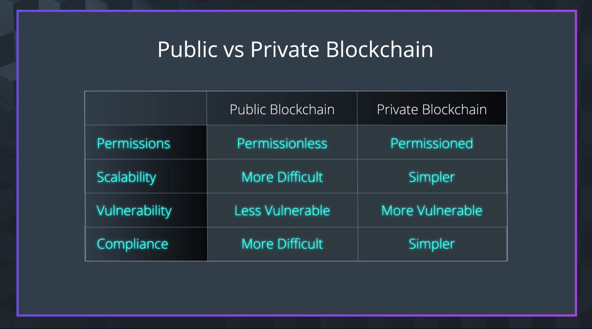

# 1. Lesson Introduction

## Lesson Overview
### Public and Private Blockchains

Compare and contrast a public blockchain vs a private blockchain and discuss methods for cross-chain functionality.

### Building a Simple Private Blockchain

Build from scratch a simple private blockchain that creates new blocks, store data in blocks, and secure blocks with a digital signature using a one-way hash.

To Build a Simple Private Blockchain, we'll work through 6 different parts that, once completed, will have you up and running with the core ideas behind building a simple private blockchain.

- Part 1: Block Data Model
- Part 2: Create New Blocks
- Part 3: Store Blocks
- Part 4: Linking Blocks
- Part 5: Block Height and Timestamp
- Part 6: LevelDB to Persist Data

## Complementary learning resources

- [JavaScript Promises](https://www.udacity.com/course/javascript-promises--ud898)
- [ES6 - JavaScript Improved](https://www.udacity.com/course/es6-javascript-improved--ud356)

# 2. Public and Private Blockchains



# 3. Public and Private Blockchain Interaction

Watch video

# 4. Build a Simple Private Blockchian

Watch video

# 5. Working with Your Workspace

# 6. Block Data Model

In this section, we'll setup our basic block data model in json.

`notes.txt`

```json
{ // Block data model
   "hash": "000000000000e198e04b0759cfecd59a95604cc551db9ad3b12a290375a95419",
   "height": 1325438,
   "body": [
   ],
   "time": ,
   "previousblockhash": ""
 }
 ```

# 7. Create New Blocks

In this section, we will create a class that creates Blocks based off the block data model we previously setup.

`simpleChain.js`

```js
/* ===== Block Class ===================================
|  Class with a constructor for block data model       |
|  ====================================================*/

class Block {
  constructor(data){
    this.height = '';
    this.timeStamp = '';
    this.data = data;
    this.previousHash = '0x';
    this.hash = '';
  }
}
```

# 8. Store Blocks

After creating our Block class, we now need to construct our blockchain to store blocks.

`simpleChain.js`

```js
/* ===== Block Class ===================================
|  Class with a constructor for block data model       |
|  ====================================================*/

class Block {
  constructor(data){
    this.height = '';
    this.timeStamp = '';
    this.data = data;
    this.previousHash = '0x';
    this.hash = '';
  }
}

/* ===== Blockchain ===================================
|  Class with a constructor for blockchain data model  |
|  with functions to support:                          |
|     - createGenesisBlock()                           |
|     - getLatestBlock()                               |
|     - addBlock()                                     |
|     - getBlock()                                     |
|     - validateBlock()                                |
|     - validateChain()                                |
|  ====================================================*/

class Blockchain{
    constructor(){
      // new chain array
      this.chain = [];
  }

  // addBlock method
  addBlock(newBlock){
     this.chain.push(newBlock);
  }
}
```

# 9. Link Blocks

In this section, our task is to secure blocks in a chain using the sha256 algorithm to hash block data.

## Recaap

To setup the crypto-js library, in the terminal we used:

`npm install crypto-js —save`

In simpleChain.js,

- Configured crypto-js library
- In Blockchain class, modified constructor to included new genesis block
- Modified addblock function to include generation of our block hash.

```js
/* ===== SHA256 with Crypto-js ===================================
|  Learn more: Crypto-js: https://github.com/brix/crypto-js      |
|  =============================================================*/

const SHA256 = require('crypto-js/sha256');

/* ===== Block Class ===================================
|  Class with a constructor for block data model       |
|  ====================================================*/

class Block {
  constructor(data){
    this.height = '';
    this.timeStamp = '';
    this.data = data;
    this.previousHash = '0x';
    this.hash = '';
  }
}

/* ===== Blockchain ===================================
|  Class with a constructor for blockchain data model  |
|  with functions to support:                          |
|     - createGenesisBlock()                           |
|     - getLatestBlock()                               |
|     - addBlock()                                     |
|     - getBlock()                                     |
|     - validateBlock()                                |
|     - validateChain()                                |
|  ====================================================*/

class Blockchain{
    constructor(){
      // new chain array
      this.chain = [];
      // add first genesis block
      this.addBlock(this.createGenesisBlock());
   }

  createGenesisBlock(){
    return new Block("First block in the chain - Genesis block");
  }

// addBlock method
  addBlock(newBlock){
    if (this.chain.length>0) {
      // previous block hash
      newBlock.previousHash = this.chain[this.chain.length-1].hash;
    }
    // SHA256 requires a string of data
    newBlock.hash = SHA256(JSON.stringify(newBlock)).toString();
    // add block to chain
    this.chain.push(newBlock);
  }
}
```

# 10. Block Height and Timestamp

## Recap

To recap, we modified our addBlock function to include block height within our newBlock object. In addition, we configure our newBlock object to include a timestamp in UTC format.

`simpleChain.js`

```js
/* ===== SHA256 with Crypto-js ===================================
|  Learn more: Crypto-js: https://github.com/brix/crypto-js      |
|  =============================================================*/

const SHA256 = require('crypto-js/sha256');

/* ===== Block Class ===================================
|  Class with a constructor for block data model       |
|  ====================================================*/

class Block {
  constructor(data){
    this.height = '';
    this.timeStamp = '';
    this.data = data;
    this.previousHash = '0x';
    this.hash = '';
  }
}

/* ===== Blockchain ===================================
|  Class with a constructor for blockchain data model  |
|  with functions to support:                          |
|     - createGenesisBlock()                           |
|     - getLatestBlock()                               |
|     - addBlock()                                     |
|     - getBlock()                                     |
|     - validateBlock()                                |
|     - validateChain()                                |
|  ====================================================*/

class Blockchain{
    constructor(){
      // new chain array
      this.chain = [];
      // add first genesis block
      this.addBlock(this.createGenesisBlock());
  }

  createGenesisBlock(){
    return new Block("First block in the chain - Genesis block");
  }

  // getLatest block method
  getLatestBlock(){
    return this.chain[this.chain.length -1];
  }

   // addBlock method
  addBlock(newBlock){
    // block height
    newBlock.height = this.chain.length;
    // UTC timestamp
    newBlock.timeStamp = new Date().getTime().toString().slice(0,-3);
    if (this.chain.length>0) {
      // previous block hash
      newBlock.previousHash = this.chain(this.chain.length-1.hash;
    }
    // SHA256 requires a string of data
    newBlock.hash = SHA256(JSON.stringify(newBlock)).toString();
    console.log(JSON.stringify(newBlock));
    // add block to chain
    this.chain.push(newBlock);
  }
```

# 11. LevelDB to Persist Data

## LevelDB to Persist Data

So far, we created a simple blockchain where blocks are strung together utilizing sha256 hashes.

In this video, I'll prepare you for some challenges ahead. One of those challenges is persisting the dataset. At this point in-time, your blockchain remains in-memory within the chain array. Upon restart of your node project, the data state does not persist.

To solve this, I'll demonstrate using levelDB node which is a LevelDB wrapper that will help us persist data.

Tip: LevelDB was originally used with the release of Bitcoin.

Learn more at [leveldb github](https://github.com/bitcoin/bitcoin/tree/master/src/leveldb).

## Recap

### Step 1: Comments

We modified the code to include comments for good practice :)

### Step 2: Install level in the terminal

`npm install level --save`

### Step 3: Review levelSandbox.js

So far, you've created a simple blockchain. The problem with this model is that the data stored in it is not persisted (not very useful for a blockchain). To solve, we will need to find a simple storage method to help us store the data. We also shouldn't use a centralized database because the purpose of the blockchain is to have decentralized data. A good solution would be to use LevelDB.

To prep you for integrating your private blockchain with LevelDB, I created the `levelSandbox.js` to demonstrate specific functionality you will build upon later.

In `levelSandbox.js` we:

- Added our level dependency
- Established our storage location for the dataset
- Configured our db object with levelDB
- Setup `addLevelDBData()` which adds data to levelDB with a key/value pair
- Setup `getLevelDBData()` which gets a value from a key
- Setup `addDataToLevelDB()` which adds a new block
- Setup `theLoop()` which tests leveldb using a self invoking function to add blocks to the chain

Currently `levelSandbox.js` is not tied to our `simpleChain.js` just yet, that's what you'll get to work on in the project.

### Code

```js
/* ===== Persist data with LevelDB ===================================
|  Learn more: level: https://github.com/Level/level     |
|  =============================================================*/

let level = require('level');
let chainDB = './chaindata';
let db = level(chainDB);

// Add data to levelDB with key/value pair
function addLevelDBData(key,value){
  db.put(key, value, function(err) {
    if (err) return console.log('Block ' + key + ' submission failed', err);
  })
}

// Get data from levelDB with key
function getLevelDBData(key){
  db.get(key, function(err, value) {
    if (err) return console.log('Not found!', err);
    console.log('Value = ' + value);
  })
}

// Add data to levelDB with value
function addDataToLevelDB(value) {
    let i = 0;
    db.createReadStream().on('data', function(data) {
          i++;
        }).on('error', function(err) {
            return console.log('Unable to read data stream!', err)
        }).on('close', function() {
          console.log('Block #' + i);
          addLevelDBData(i, value);
        });
}

/* ===== Testing ==============================================================|
|  - Self-invoking function to add blocks to chain                             |
|  - Learn more:                                                               |
|   https://scottiestech.info/2014/07/01/javascript-fun-looping-with-a-delay/  |
|                                                                              |
|  * 100 Milliseconds loop = 36,000 blocks per hour                            |
|     (13.89 hours for 500,000 blocks)                                         |
|    Bitcoin blockchain adds 8640 blocks per day                               |
|     ( new block every 10 minutes )                                           |
|  ===========================================================================*/


(function theLoop (i) {
  setTimeout(function () {
    addDataToLevelDB('Testing data');
    if (--i) theLoop(i);
  }, 100);
})(10);
```

# 12. Practice LevelDB and Promises
# 13. Lesson Recap
# 14. Projectx Prep